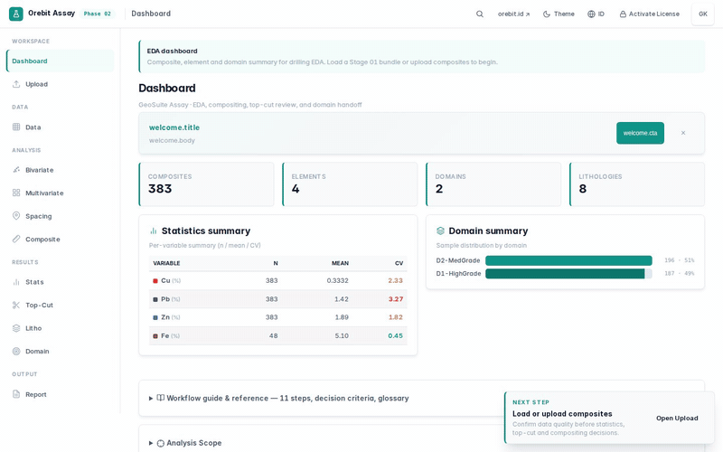
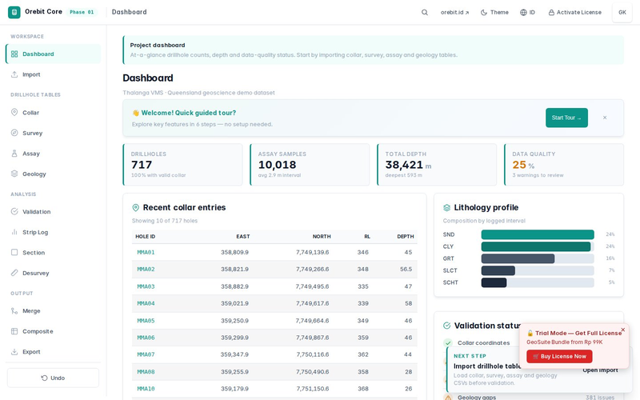
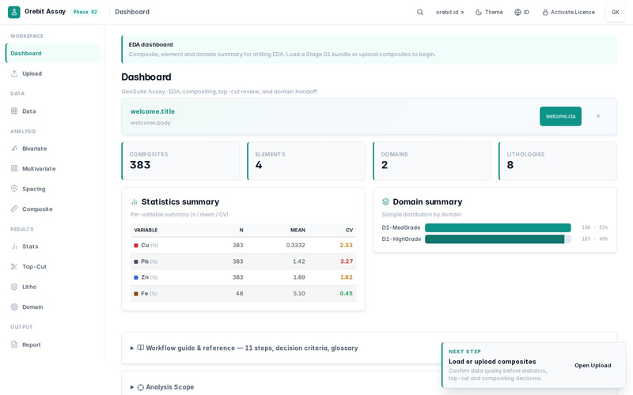
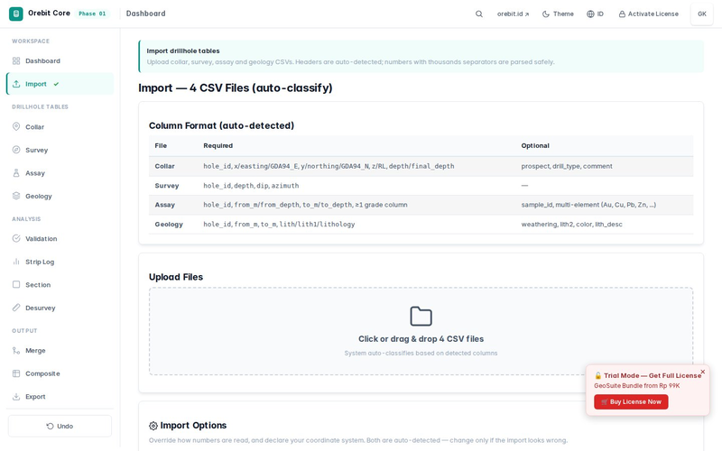
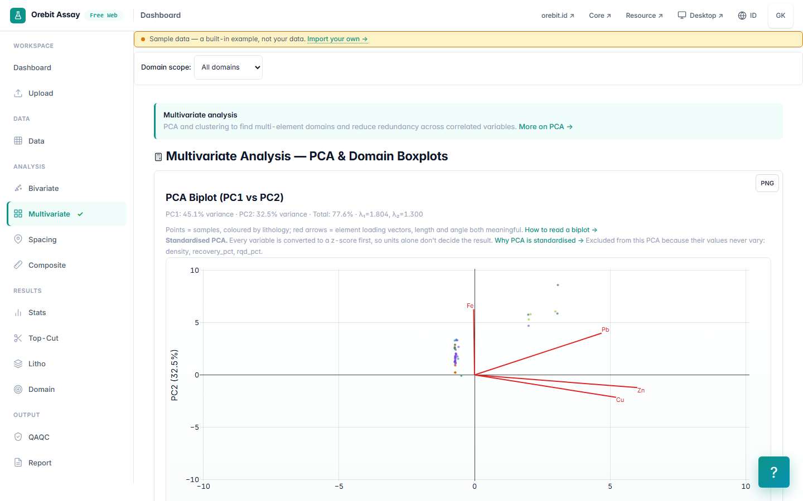

<div align="center">

# ⛏️ Orebit GeoSuite

**Drillhole data preparation · EDA · Resource estimation — 100% offline Windows EXE**

[](https://github.com/ghoziankarami/geosuite/releases)
[](https://github.com/ghoziankarami/geosuite)
[]()
[]()
[]()

**Geological data workflows built for mineral exploration — from raw drillhole CSV to resource-ready output, fully offline.**



</div>

---

## 📦 What is GeoSuite?

Orebit GeoSuite is a **geologist-first toolkit** for mineral exploration data. It runs **100% offline** — perfect for field camps, sites without internet, and privacy-sensitive environments.

**Free to use, permanently** — web and Desktop Edition alike, no trial, no paywall. Sustained by voluntary [Support Orebit](https://saweria.co/orebitindonesia) contributions from users who find it valuable.

Every workflow is checked against **SNI 4726:2019, KCMI, and JORC** resource-reporting standards.

| Module | Function |
|--------|----------|
| **Core** | Drillhole validation, composite, desurvey, export |
| **Assay** | EDA: statistics, top-cut, domaining, tonnage estimation |
| **Resource** | Variography, ordinary kriging, resource classification |
| **Bundle** | All three modules in one ZIP |

> 💡 Try the **free web version** at [geosuite.orebit.id/try/](https://geosuite.orebit.id/try/) — full features, no install.

---

## 🚀 Quick Start (2 steps)

**Step 1 — Double-click `Orebit-*.exe`**
- WebView2 Runtime auto-installs in the background (one-time)
- A free license key request prompt appears

**Step 2 — Request your free license key**
- Enter your email — a free, permanent key is sent instantly
- Paste the key → click **Activate** → done!

Activation is **once per machine**. After activation the app opens directly every time.

---

## 🖼️ Product Screenshots

### Core — Project Dashboard


### Assay — EDA Dashboard


### Data Import


### Multivariate Analysis


---

## 🔬 Workflow — 3 Stages

```
Stage 1 — Core      → validate + composite + desurvey drillhole
Stage 2 — Assay     → exploratory data analysis (EDA)
Stage 3 — Resource  → resource estimation (JORC/KCMI/SNI)
```

Read **`docs/Orebit-GeoSuite.pdf`** (included in every package) for the complete manual — CSV format for collar/survey/assay, parameter reference, and export guide.

---

## 📦 Package Layout

```
Orebit-{Module}-vX.Y.Z.zip
├── Orebit-Core.exe          ← double-click, ready to use
├── docs/
│   └── Orebit-GeoSuite.pdf
└── README.txt               ← guide + license
```

> WebView2 Runtime auto-installs on first run. No manual setup needed.

---

## 🆘 Troubleshooting

**Q: "Windows protected your PC" (SmartScreen)**
**A:** Click **More info** → **Run anyway**. New software without an EV certificate triggers this — normal and safe.

**Q: EXE opens no window at all**
**A:** WebView2 failed to auto-install. Fix:
1. Install manually: https://developer.microsoft.com/en-us/microsoft-edge/webview2/
2. Choose **"Evergreen Standalone Installer"**
3. Run the EXE again

**Q: "Invalid key"**
**A:** (1) Ensure the key has no extra spaces. (2) Keys are case-sensitive. (3) Confirm the key matches the product (BNDL unlocks all modules). (4) Contact hello@orebit.id if it still fails — free replacement keys are sent on request.

**Q: Does it run on Linux / Mac?**
**A:** The EXE is Windows-only. Use the full-featured web version at [geosuite.orebit.id/try/](https://geosuite.orebit.id/try/) in any modern browser.

---

## 📞 Contact & Support

- **Email**: [hello@orebit.id](mailto:hello@orebit.id)
- **Web**: [orebit.id](https://orebit.id) · [geosuite.orebit.id](https://geosuite.orebit.id)
- **Support hours**: 09:00–17:00 WIB (Mon–Fri)

---

## 📜 License

**Free, permanent license.** Core, Assay, and Resource are free to use — web and Desktop Edition alike — for personal and business work, with no trial period or expiry.

**NOT permitted:** Public redistribution, or reselling access to the EXE/key.

Orebit GeoSuite is sustained by voluntary, open-amount support from users who find it valuable — see [Support Orebit](https://saweria.co/orebitindonesia). This is entirely optional and not required to use the software.

For team / company / multi-seat deployments, contact [hello@orebit.id](mailto:hello@orebit.id).

---

<div align="center">

© 2026 [Orebit](https://orebit.id) · Free to use · Built by [Ghozian Islam Karami](https://github.com/ghoziankarami)

</div>
