# Vignette 01 — Thalanga (VMS Zn-Pb-Cu-Ag-Au): dari data publik mentah ke skrining sumber daya yang bisa dipertanggungjawabkan

> **English:** [en/01-thalanga-vms.md](en/01-thalanga-vms.md)

| | |
|---|---|
| **Data** | *NEQ Deposit Atlas – Thalanga* (ds100103), Geological Survey of Queensland, **CC BY 4.0** — <https://geoscience.data.qld.gov.au/dataset/ds100103>. Ini juga dataset contoh bawaan Orebit Core, jadi Anda bisa mengikuti vignette ini tanpa mengunduh apa pun. |
| **Modul** | Core → Assay → Resource |
| **Waktu** | ±45 menit bila diikuti manual |
| **Hasil akhir** | Skrining *grade-tonnage* yang jujur, lengkap dengan daftar alasan mengapa hasil ini **belum** Sumber Daya Mineral |
| **Bisa diulang** | `node build/build.mjs && python3 docs/vignettes/tools/run_thalanga.py` — seluruh angka di halaman ini dibaca dari [`data/thalanga.json`](data/thalanga.json) yang ditulis skrip itu, dan `test_vignettes.py` menggagalkan build bila aplikasi mulai menghasilkan angka lain. |

Vignette ini sengaja tidak memakai data "bersih" buatan. Data kompilasi pemerintah seperti ini persis yang sering diterima geologis eksplorasi di dunia nyata: ratusan lubang dari banyak perusahaan dan banyak dekade, kode laboratorium yang berganti-ganti, lubang geokimia dangkal bercampur lubang intan dalam. Tujuannya bukan menghasilkan angka yang indah, tetapi menunjukkan **setiap keputusan** yang harus diambil geologis, **alasannya**, dan **apa yang terjadi bila keputusan itu dilewati**.

---

## 0. Konteks geologi dan patokan pembanding

Thalanga adalah endapan sulfida masif vulkanogenik (VMS) Zn-Pb-Cu-Ag-Au di Mount Windsor Subprovince, ±65 km barat daya Charters Towers, Queensland. Tambang bawah tanahnya berproduksi **1989–1998** dan menghasilkan **4,7 Mt @ 8,3 % Zn, 2,6 % Pb, 1,9 % Cu** ([mining-technology.com](https://www.mining-technology.com/projects/thalanga-zinc-project-queensland/)).

Angka produksi itulah patokan kita. Jangan pernah menilai sebuah estimasi hanya dari "apakah program selesai tanpa error". Tanyakan: *apakah hasilnya masuk akal dibanding sesuatu yang diketahui secara independen?* Di akhir (§12) kita membandingkan hasil skrining dengan patokan ini dan menjelaskan selisihnya.

Satu catatan jujur sejak awal: data ini **tidak memuat logging litologi untuk lubang-lubang bor intan di endapan utama**. Tanpa litologi tidak ada model geologi. Itu membatasi segalanya setelahnya, dan kita akan melihat akibatnya dengan jelas.

---

## 1. Memuat data (Core)

Buka **Orebit Core**. Dataset Thalanga termuat otomatis sebagai contoh.

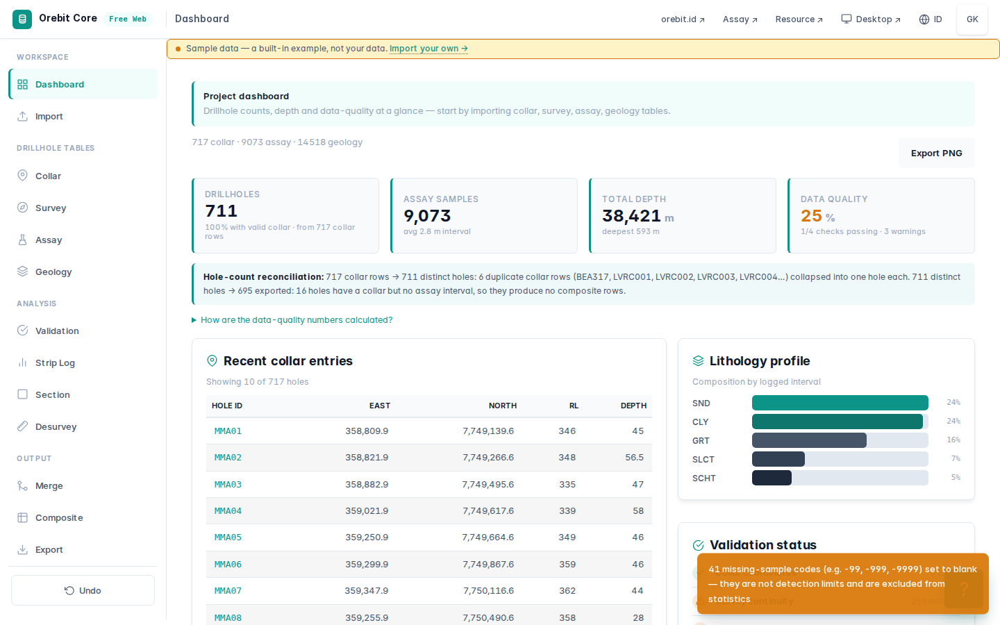

| Tabel | Baris |
|---|---:|
| Collar | 717 |
| Survey | 667 |
| Assay | 9.073 |
| Geology | 14.518 |

Sebelum melihat peta, lihat dulu **jenis lubangnya**:

| Tipe bor | Jumlah lubang |
|---|---:|
| BEDRK (geokimia batuan dasar, dangkal) | 520 |
| REVC (RC) | 55 |
| PERC (perkusi) | 45 |
| RAB | 39 |
| ACORE | 21 |
| TCH (paritan) | 19 |
| DD (bor intan) | 18 |

**Pelajaran pertama:** ini kompilasi regional, bukan basis data bor sebuah endapan. Tiga perempat lubangnya adalah lubang geokimia dangkal untuk mencari anomali, bukan untuk mengukur tonase. Kalau semua lubang ini dicampur ke dalam estimasi, ratusan sampel "latar belakang" dari puluhan kilometer jauhnya ikut mempengaruhi statistik dan variogram. Langkah pemotongan (§4) ada karena alasan ini.

---

## 2. Kode kadar laboratorium: angka negatif bukan angka

Data assay lama memakai angka negatif sebagai kode, dan artinya berbeda-beda antar laboratorium dan antar dekade. Core mendeteksinya saat impor dan menerapkan satu aturan yang terdokumentasi (`src/shared/io/grades.js`):

- **nilai negatif biasa** (−0,01; −5; −0,0001) → *di bawah batas deteksi*, dipakai **setengah** batas deteksi;
- **kode "semua sembilan"** (−999, −9999 …) **atau** nilai negatif yang besarnya melampaui nilai positif maksimum kolom itu → **data hilang** (kosong), karena mustahil ada batas deteksi yang lebih tinggi daripada kadar tertinggi yang pernah diukur;
- **`>X`** (di atas batas atas) → X, dan ditandai.

Hasilnya pada Thalanga: **2.428** nilai di bawah batas deteksi dan **41** kode data hilang.

| Kolom | < batas deteksi | Kode hilang | Nilai positif maks. |
|---|---:|---:|---:|
| au_gpt | 1.223 | 0 | 1.380 |
| ag_gpt | 578 | 19 | 9.560 |
| s_pct | 485 | 7 | 5 |
| cu_ppm | 68 | 0 | 114.200 |
| pb_ppm | 68 | 15 | 248.000 |
| zn_ppm | 6 | 0 | 406.000 |

Mengapa ini penting: kolom Pb berisi kode **−995.000** dan Ag **−9.910.000**. Program yang memperlakukan setiap angka negatif sebagai "setengah batas deteksi" akan memberi sampel-sampel itu kadar Pb 49 % dan Ag 4.955 g/t, yaitu 15 bonanza palsu. Program yang memperlakukannya sebagai nol, atau membuangnya diam-diam, menurunkan rata-rata tanpa jejak. Aturan batas maksimum di atas membedakan kedua kasus tanpa perlu tebakan per laboratorium, dan **Au 1.223 nilai deteksi-batas dari beberapa era** (−0,01; −0,05; −0,0001) tetap diperlakukan dengan benar sebagai nilai rendah yang nyata.

> Periksa sendiri: di tab **Validation** Core, baris *Below-detection (negative) grade values* menunjukkan **0** setelah impor. Itu bukan berarti datanya bersih. Artinya semua kode sudah diterjemahkan dan dicatat.

---

## 3. Validasi: temukan, putuskan, catat

Tab **Validation** Core menjalankan 16 pemeriksaan.

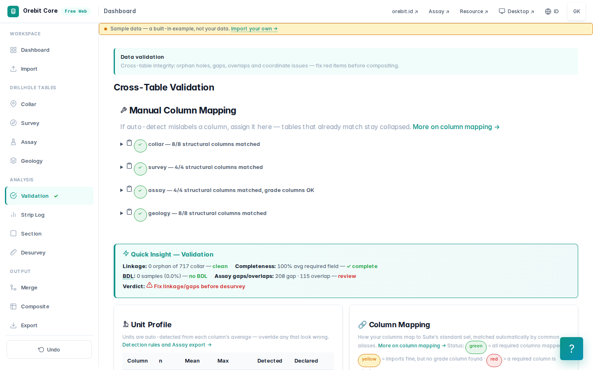

| Pemeriksaan | Sebelum | Sesudah perbaikan |
|---|---|---|
| Collar tanpa survey (dianggap vertikal) | 259 lubang ⚠ | 259 ⚠ |
| Collar tanpa assay | 16 lubang ⚠ | 16 ⚠ |
| Collar tanpa geologi | 381 lubang ⚠ | 381 ⚠ |
| **hole_id collar ganda** | **6 ✗** | 6 ✗ |
| Celah (gap) interval assay | 208 ⚠ | 206 ⚠ |
| **Tumpang tindih (overlap) interval assay** | **115 ✗** | 113 ✗ |
| Keputusan keterkaitan | **FIX REQUIRED** | **FIX REQUIRED** |

Apa isi temuan itu (diperiksa baris demi baris):

- **6 collar ganda.** LVRC001–LVRC005 tercatat dua kali, di bawah dua program berbeda (RGMWP dan TCLV), dengan selisih koordinat 1–5 cm. Ini lubang yang sama, dikompilasi dua kali. BEA317 tercatat sebagai ACORE dan BEDRK.
- **115 overlap.** Umumnya sampel ulang atau komposit lapangan yang ikut dikompilasi. Contoh: TCRC11 berisi interval 4–5 m *dan* komposit 4–8 m.
- **259 lubang tanpa survey** akan dianggap vertikal. Semuanya lubang dangkal (236 BEDRK, 20 perkusi, 3 RC; median kedalaman 36 m, terdalam 150 m), jadi efeknya kecil. Pada lubang dalam, anggapan ini fatal (§4).
- **381 lubang tanpa geologi, termasuk semua lubang bor intan di endapan.**

### Dua perbaikan yang dilakukan, dan mengapa hanya dua

1. **Dua spot sample di TH37** (190,0–190,2 m dan 490,0–490,2 m, ID sampel `TH37190`, `TH37490`) berada sepenuhnya *di dalam* interval yang lebih panjang di lubang yang sama. Ini sampel cek yang ikut terkompilasi. Keduanya dihapus, karena kalau dibiarkan interval yang sama terhitung dua kali.
2. **Au 1.380 g/t di TH35 100,0–100,2 m.** Nilai tertinggi berikutnya di seluruh dataset hanya 1,69 g/t, sekitar 800× lebih kecil. Pada interval yang sama Ag hanya 1 g/t dan Zn 1.210 ppm. Bonanza emas tanpa perak dan tanpa logam dasar di sistem VMS secara geologi tidak masuk akal; yang paling mungkin adalah salah satuan atau salah koma. **Nilai itu dikosongkan, bukan "dikoreksi" menjadi 1,38.** Kita tidak menebak isi sertifikat laboratorium. Kosongkan, catat, dan minta sertifikat aslinya.

Keduanya dilakukan di editor data Core dan tercatat otomatis di **CHANGE_LOG**:

```
assay: 1 rows edited, 0 added, 2 deleted
```

CHANGE_LOG ikut terekspor. Siapa pun yang menerima file Anda bisa melihat persis apa yang diubah dan kapan.

### Mengapa status tetap "FIX REQUIRED", dan itu benar

Sisa masalah (collar ganda LVRC/BEA, ratusan overlap TCRC dan sejenisnya) semuanya berada di **lubang regional di luar area endapan**. Geologis senior tidak "membersihkan" data yang tidak akan dipakai hanya supaya lampu indikator hijau. Data itu **dikeluarkan secara eksplisit** lewat batas area (§4), dan alasannya ditulis. Status merah di sini adalah catatan yang jujur, bukan kegagalan.

---

## 4. Desurvey dan pemotongan ke area endapan

### Desurvey

Tab **Desurvey** mendeteksi konvensi dip dari data: `positive_down`, yaitu dip positif berarti ke bawah. Hasilnya: 711 lubang ter-desurvey, 0 survey rusak.

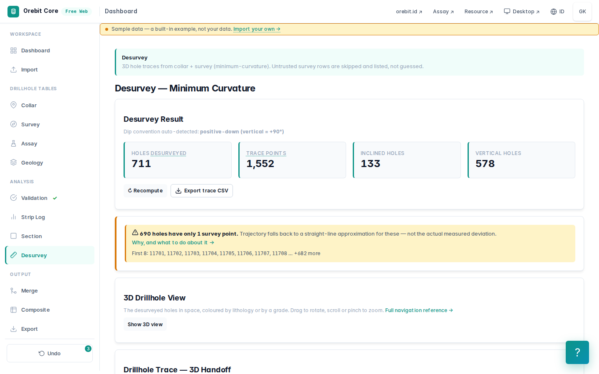

Lubang-lubang intan di Thalanga **melandai sangat kuat** ke arah dasarnya:

| Lubang | Kedalaman akhir | Elevasi dasar lubang (z) |
|---|---:|---:|
| TH1 | 257 m | 140,9 m |
| TH5 | 395,9 m | 117,2 m |
| TH40 | 593,3 m | −103,1 m |

TH5 sepanjang hampir 400 m hanya turun sekitar 180 m dan berakhir hampir horizontal. Seandainya survey diabaikan dan lubang dianggap vertikal, setiap sampel di bagian bawah TH5 akan diletakkan ratusan meter terlalu dalam dan puluhan meter dari posisi sebenarnya. Estimasi blok yang dibangun di atas posisi itu salah secara spasial, tanpa ada satu pun pesan error.

### Pemotongan (crop) ke area endapan

Karena tidak ada logging litologi di lubang endapan, kita tidak bisa membangun *wireframe* geologi. Batas yang jujur adalah **kotak area endapan** yang dibatasi secara eksplisit di sekitar lubang-lubang seri TH (MGA zona 55):

```
X 370.200 – 372.900 m   Y 7.750.000 – 7.750.800 m
```

File: [`data/thalanga-deposit-area.geojson`](data/thalanga-deposit-area.geojson). Muat di tab **Crop to Constraint**.

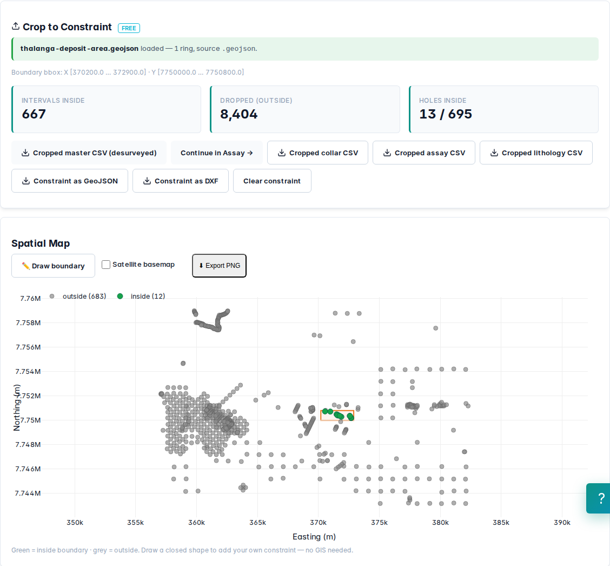

| | |
|---|---:|
| Interval di dalam | **667** dari 9.071 |
| Interval dibuang | 8.404 |
| Lubang di dalam | **13** dari 695 |

Perhatikan: peta menunjukkan **12 collar** di dalam kotak, tetapi **13 lubang** menyumbang interval. Core memotong berdasarkan **posisi titik tengah interval yang sudah ter-desurvey**, bukan posisi collar. Satu lubang di-collar di luar kotak tetapi menembus ke dalamnya. Pemotongan berbasis collar akan kehilangan interval itu.

Lubang yang tersisa: TE-1, TE-2, TH1, TH2, TH3, TH4, TH5, TH6, TH31, TH35, TH37, TH39, TH40. Ke-13 lubang ini (11 bor intan, 2 perkusi) semuanya punya survey, tidak ada yang termasuk collar ganda, dan satu-satunya overlap di dalamnya adalah dua spot sample TH37 yang sudah dihapus di §3. Ekspor **Cropped master CSV (desurveyed)** untuk langkah berikutnya.

---

## 5. Kenali populasinya sebelum memutuskan apa pun

Sebelum masuk ke Assay, statistik 667 sampel ini dihitung **terpisah dari aplikasi** (Python murni, langsung dari CSV hasil ekspor):

| Zn (%) | |
|---|---:|
| Rata-rata | 2,245 |
| Median | 0,2 |
| Koefisien variasi (CV) | **2,66** |
| P95 / P99 / maks. | 15,1 / 31,2 / 40,6 |
| Panjang sampel median / modus | 0,7 m / 1,0 m |

Rata-rata sebelas kali median, dengan CV 2,66. Distribusi seperti ini bisa berarti dua hal yang penanganannya sangat berbeda:

- **satu populasi dengan beberapa pencilan** → diperlakukan dengan *top-cut*;
- **campuran dua populasi** (bijih sulfida masif dan batuan samping) → diperlakukan dengan **domain**.

Uji sederhana yang membedakannya adalah melihat di mana logamnya berada:

| Sampel dengan Zn ≥ | Bagian logam Zn total |
|---|---:|
| 0,5 % | 95,7 % |
| 1 % | **91,7 %** |
| 2 % | 87,0 % |
| 5 % | 74,6 % |

Lalu pisahkan pada 1 % Zn:

| | n | Rata-rata Zn | CV |
|---|---:|---:|---:|
| ≥ 1 % (di dalam *shell*) | 170 | 8,26 % | **1,15** |
| < 1 % (di luar) | 497 | 0,187 % | 1,26 |

CV turun dari 2,66 menjadi 1,15 begitu kedua populasi dipisah. **Variabilitas tinggi itu berasal dari campuran populasi, bukan dari pencilan.** Kesimpulan ini menentukan dua keputusan berikutnya: *jangan* memangkas kadar tinggi, dan *pisahkan* domain.

---

## 6. Assay: pilih komoditas, uji top-cut, bangun domain

Unggah master CSV hasil crop ke **Orebit Assay**. Assay mengenali satuan dari nama kolom dan mengonversi `zn_ppm`, `pb_ppm`, `cu_ppm` menjadi persen (÷ 10.000). Konversi itu ditampilkan, tidak dilakukan diam-diam.

### Pilih komoditas utama

Secara bawaan Assay mengambil kolom kadar pertama, yaitu **cu_pct**. Untuk endapan seng, itu keliru. Pilih **zn_pct** di pemilih **Commodity**. Pilihan ini berlaku untuk validasi, domain, QAQC, laporan, dan PDF.

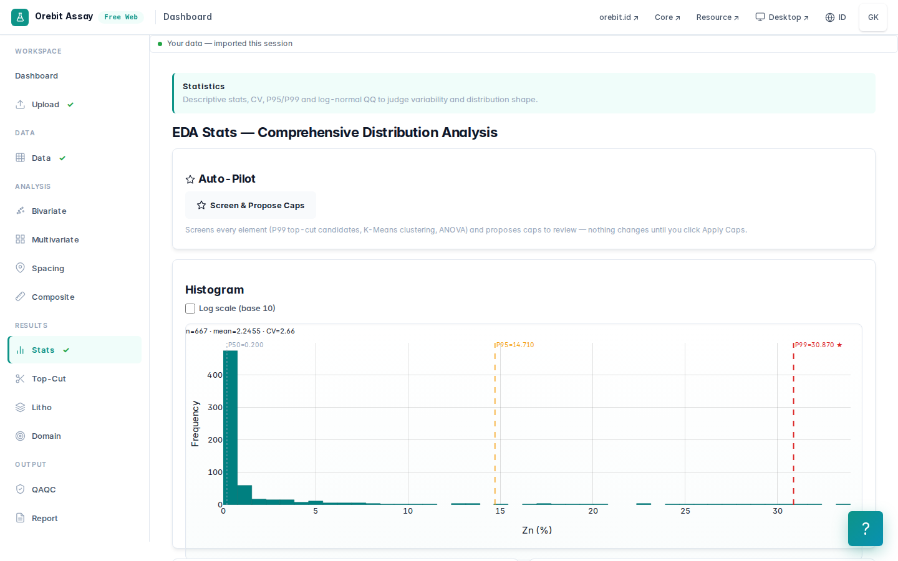

### Top-cut: diuji, lalu sengaja tidak dipakai

Tab **Top-Cut** mencari titik *disintegrasi*, yaitu tempat ekor distribusi mulai terputus-putus. Pada Zn titik itu ada di **27,5 %** (persentil 98,1).

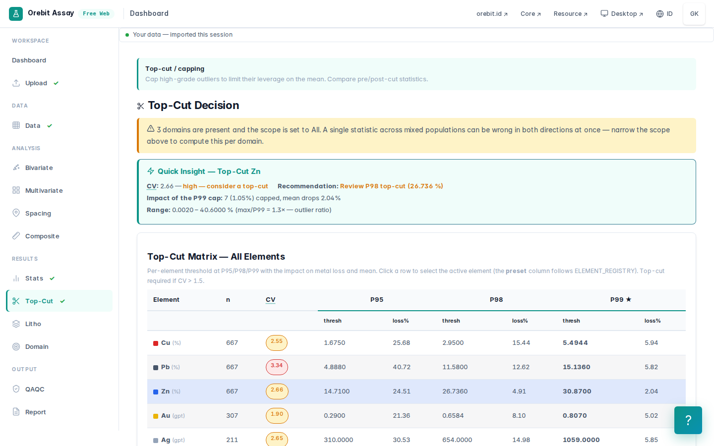

**Keputusan: tidak ada top-cut untuk Zn.** Alasannya:

1. §5 menunjukkan variabilitas berasal dari campuran populasi. Di dalam domain mineralisasi CV hanya 1,15, jauh di bawah ambang yang biasanya membuat geologis mempertimbangkan pemangkasan (sekitar 1,5–2).
2. Zn 27–40 % adalah sulfida masif kaya sfalerit, **populasi nyata** yang memang ditambang di sini. Memangkasnya ke 27,5 % berarti menghapus logam nyata dari bijih terbaik.
3. Top-cut dipakai untuk membatasi pengaruh *sedikit* sampel ekstrem terhadap *banyak* blok. Masalah itu ditangani lebih baik oleh strategi pencarian (§8).

Keputusan tidak memangkas sama pentingnya dengan keputusan memangkas, dan **harus ditulis** di laporan beserta alasannya.

### Domain: *grade shell* 1 % Zn, karena tidak ada litologi

Tab **Domain** → metode **Grade shell (cut-off)**, cut-off **1** (% Zn).

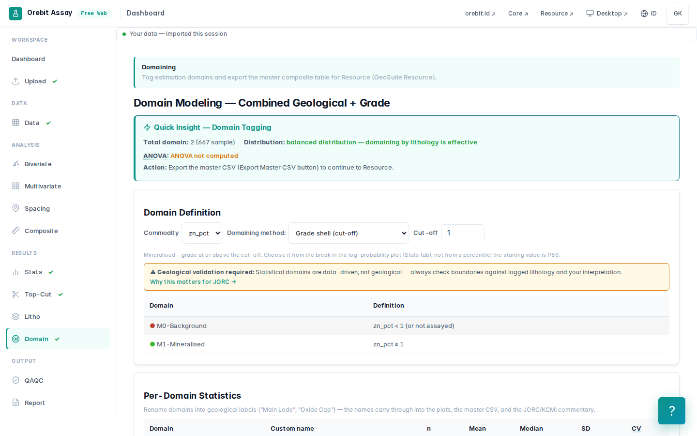

| Domain | Sampel |
|---|---:|
| M1-Mineralised (Zn ≥ 1 %) | 170 |
| M0-Background (Zn < 1 % atau tidak dianalisis) | 497 |

Mengapa 1 %: angka itu menangkap 91,7 % logam (§5), memisahkan dua populasi dengan CV yang wajar, dan cukup rendah sehingga tidak "memotong" bijih. Cut-off *domain* bukan cut-off *ekonomi*. Ia memisahkan populasi, bukan menentukan apa yang layak ditambang.

**Keterbatasan yang harus diakui:** *grade shell* bukan domain geologi. Ia dibentuk oleh kadar itu sendiri, sehingga cenderung terlalu optimistis di tepi (sampel rendah di antara sampel tinggi ikut dibuang) dan tidak tahu apa-apa tentang kontak litologi atau struktur. Dengan logging litologi, domain seharusnya dibangun dari kontak sulfida masif / stringer / batuan samping. Karena datanya tidak ada, kita memakai *grade shell* dan menulis keterbatasan ini.

### Kompositing 1 m

Tab **Composite**, panjang **1 m** (modus panjang sampel).

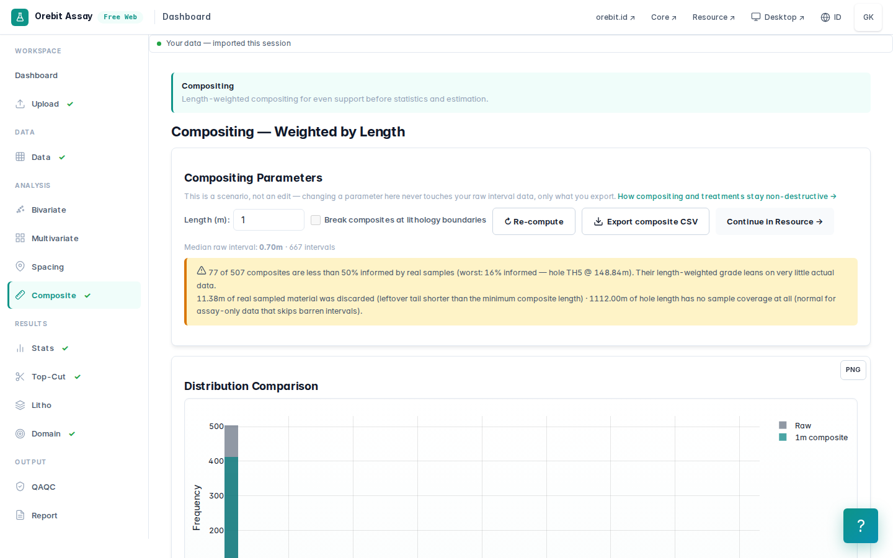

| | |
|---|---:|
| Komposit | **507** (M1: 98, M0: 409) |
| Sampel nyata yang terbuang (ekor < panjang minimum) | 11,38 m |
| Panjang lubang tanpa sampel sama sekali | 1.112 m |
| Overlap | 0 |
| Komposit yang < 50 % terisi sampel nyata | 77 |

Core memperlakukan interval tanpa sampel sebagai **tidak diketahui**, bukan nol. Pada data kompilasi, interval yang tidak dianalisis biasanya *dianggap* barren oleh pengebor, tetapi anggapan itu harus diputuskan geologis, bukan program. Setiap komposit membawa kolom `coverage`. Peringatan kuning di layar menandai **77 komposit** yang kurang dari separuhnya berisi sampel nyata. Periksa itu sebelum estimasi.

Ekspor **Export composite CSV** (`exportMasterForEstimation`). File itu sudah membawa koordinat, domain, dan kadar dalam persen.

---

## 7. Resource: setup, variogram, model blok

Unggah komposit ke **Orebit Resource**. Di **Setup** pilih elemen **zn_pct** dan domain **M1-Mineralised**: 98 komposit.

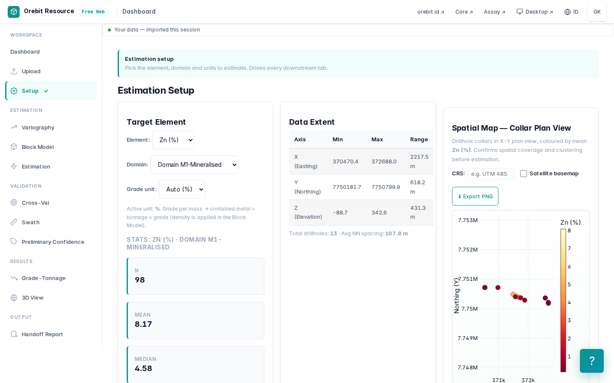

### Variogram

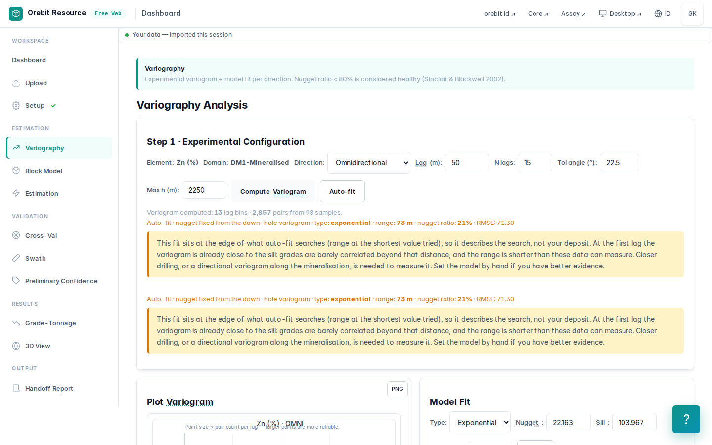

**Mulai dari sepanjang lubang.** Komposit terdekat antar lubang berjarak sekitar 90 m, sehingga nugget, yaitu variabilitas pada jarak nol, hanya bisa dibaca *sepanjang* lubang. Buka **Variogram Downhole** di tab **Variography**: pasangan sampel dalam lubang yang sama, lag 2 m. Ditemukan **840** pasangan dalam-lubang, dan γ naik dari **22,2** (%²) pada 1 m menjadi **113,5** pada 15 m. Ini struktur jarak pendek yang nyata: dalam beberapa meter kadar berubah dari sulfida masif ke batuan samping.

**Lalu antar lubang.** **Compute** variogram eksperimental lalu **Auto-fit**. Karena variogram downhole sudah ada untuk elemen dan domain ini, auto-fit menahan nugget pada nilai downhole dan hanya mencocokkan sill dan range: **eksponensial**, nugget **22,2**, sill **104,0** (%²), range **72,5 m**. Nugget sekitar 21 % dari sill.

Aplikasi menandai range itu dengan warna kuning, dan memang seharusnya: **72,5 m adalah range terpendek yang boleh dicoba oleh fitting**, bukan hasil ukur. Lag pertama menjelaskan alasannya. Pada 0–50 m, tempat hampir semua pasangan adalah pasangan sepanjang lubang, γ sudah **77,4**, yaitu 97 % dari varians data (80,0), dan variogram downhole melewati varians itu pada 15 m. Sepanjang lubang, kadar Zn berhenti berkorelasi dalam sekitar 10–15 m, kira-kira setebal satu lensa. Searah jurus, kontinuitasnya sama sekali tidak terukur: lubang terdekat berjarak 90 m.

Artinya bagi estimasi: dengan lubang berjarak sekitar 90 m (lihat bawah), blok di antara lubang mendapat nilai yang mendekati rata-rata lokal tetangganya. Perataan itu dipaksakan oleh jarak bor, bukan oleh pilihan model. Hanya bor sisipan (*infill*) yang bisa menyelesaikannya, dan Competent Person akan menimbangnya dalam klasifikasi apa pun.

> **Koreksi yang dipaksakan vignette ini.** Revisi sebelumnya melaporkan nugget 67,2, "60 % dari sill". Itu adalah batas atas grid fitting (pencarian nugget berhenti di 60 %) yang dilaporkan seolah-olah sifat endapan. Artefak yang sama muncul di Babbitt dan di satu dataset emas epitermal. Grid kini mencapai 90 %, nugget diambil dari variogram downhole, dan hasil fit yang jatuh di tepi grid diberi tanda. Validasi silang ikut membaik (slope OK 0,68 → 0,75, §9).

### Ukuran blok

Aplikasi menyarankan 15 × 15 × 8 m. Tab Estimation melaporkan **jarak antar lubang terdekat: median 91 m, P90 96 m**. Blok yang jauh lebih kecil dari seperempat jarak bor hanya memberi ilusi resolusi: kriging pada blok 15 m di antara lubang yang berjarak 90 m menghasilkan ratusan blok dengan kadar hampir sama yang tampak seperti detail padahal bukan.

Dipakai **25 × 25 × 10 m** (sekitar ¼ jarak lubang; 10 m = tinggi *bench*/level tipikal). Hasilnya **20.967 blok** (84 × 20 × 29). Densitas dibiarkan pada nilai bawaan **2,8 t/m³**, dan aplikasi dengan tepat menandainya sebagai **ASUMSI** (§11).

---

## 8. Estimasi: pelajaran terpenting di vignette ini

Tiga percobaan di tab **Estimation**, dengan komposit dan variogram yang sama. Yang berubah hanya dua keputusan: **batas domain** dan **strategi pencarian**.

### Percobaan A — parameter bawaan, tanpa batas domain

Matikan **Keep blocks inside the domain**. Itulah perilaku semua versi GeoSuite sebelum 25 September 2026. Pakai radius pencarian yang disarankan otomatis (1,5 × range variogram, dilebarkan untuk data jarang): **218 × 218 × 135 m**, minimal 2 komposit.

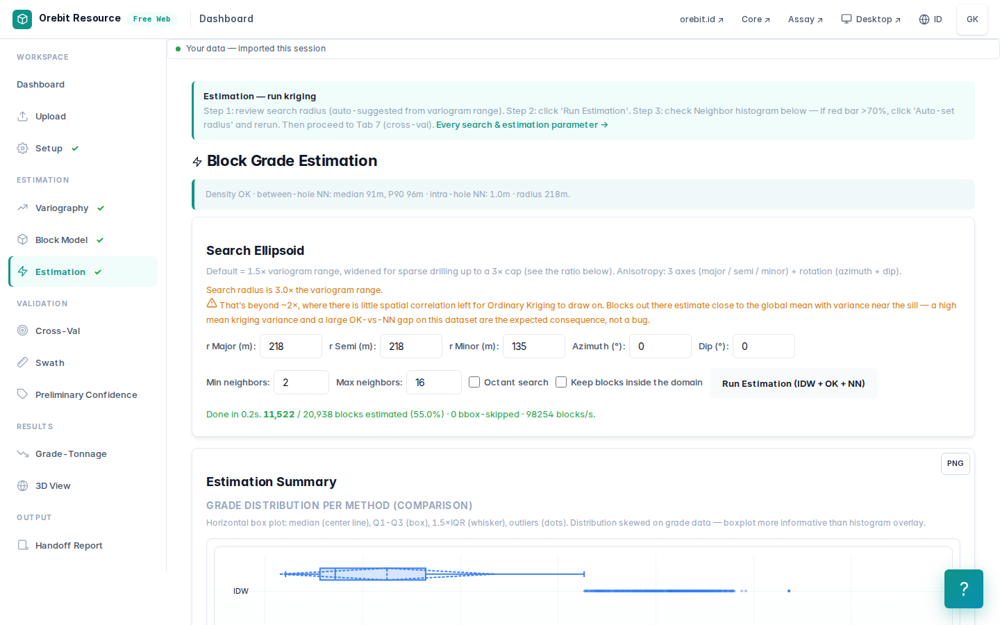

| | |
|---|---:|
| Blok terestimasi | **11.522** dari 20.967 |
| Tonase (2,8 t/m³) | **202 Mt** |
| Logam Zn | **11,9 Mt** |
| Kadar OK terendah | 1,05 % |

Ini **43 kali** produksi historis. Tidak ada error, tidak ada peringatan merah, dan angkanya salah total. Estimasi memakai komposit domain M1 saja (semua ≥ 1 % Zn), lalu **menyebarkan kadar itu ke setiap blok dalam radius 218 m**, termasuk ratusan meter batuan samping. Kadar blok terendah 1,05 % karena tidak ada satu pun sampel rendah yang ikut.

### Batas domain tanpa wireframe

Tanpa litologi tidak ada wireframe. Namun 409 komposit M0 (Zn < 1 %) tetap tahu di mana *bukan* bijih. GeoSuite kini memakai semuanya sebagai batas: **sebuah blok masuk domain M1 hanya bila komposit terdekatnya, dari domain mana pun dan diukur dengan elipsoid pencarian yang sama, adalah komposit M1.** Ini penugasan domain *nearest-neighbour*, cara standar membangun batas keras dari data bor bila belum ada model geologi. Opsi ini aktif secara bawaan.

> Fitur ini ditambahkan ke GeoSuite justru karena Percobaan A di vignette ini.

### Percobaan A2 — parameter bawaan, dengan batas domain

| | |
|---|---:|
| Blok terestimasi | **810** |
| Blok dalam jangkauan yang dikeluarkan batas domain | 20.123 |
| Tonase | **14,2 Mt** @ **7,38 %** Zn |

Batas domain saja memangkas tonase 14 kali. Tetapi 14 Mt masih 3 kali produksi, karena elipsoid bulat 218 m masih menjangkau jauh ke arah yang **tidak dibor sama sekali**. Di tepi area bor tidak ada komposit M0 yang bisa "menolak" blok, jadi komposit M1 terluar menjadi yang terdekat bagi blok-blok ratusan meter jauhnya.

### Percobaan B — batas domain + pencarian yang dibatasi geologi

Arah jurus dari sebaran komposit (PCA): **azimut 98°**, kira-kira timur–barat, sesuai sebaran lubang seri TH. Parameter:

| | | Alasan |
|---|---|---|
| r Major | 100 m | ± setengah jarak antar lubang sepanjang jurus |
| r Semi | 50 m | geometri melintang jurus tidak terselesaikan (lihat bawah) |
| r Minor | 25 m | ketebalan lensa jauh di bawah 100 m |
| Azimut / dip | 98° / 0° | jurus dari data; kemiringan tidak bisa ditentukan dengan andal |
| Min / maks komposit | 4 / 12 | tidak ada blok yang diisi satu intersep saja |

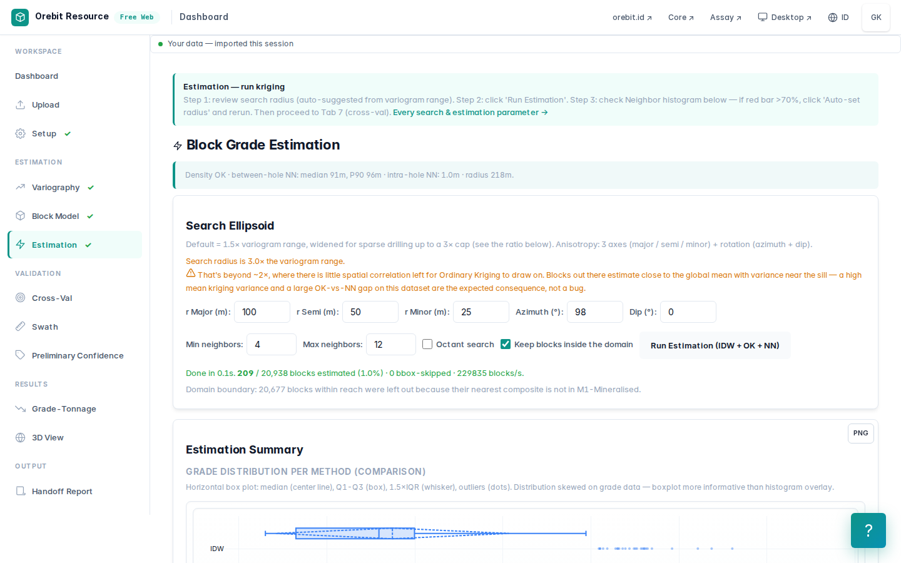

| | OK | IDW | NN |
|---|---:|---:|---:|
| Blok | 209 | 209 | 209 |
| Kadar rata-rata Zn | **8,09 %** | 8,72 % | 9,24 % |
| Tonase | **3,658 Mt** | | |
| Logam Zn | **295,8 kt** | | |

**Kemiringan (dip) lensa tidak terselesaikan.** Penampang melintang antar lubang memberi kemiringan 2°, 12°, dan 41°, tidak konsisten. Dengan 13 lubang tanpa litologi, orientasi lensa tidak bisa ditentukan. Karena itu elipsoid dibuat pipih dan kecil ke arah melintang. Ini pilihan konservatif, dan ini pula keterbatasan terbesar hasil ini.

**Cek rata-rata global:** rata-rata NN (9,24 %) **14 % di atas** OK (8,09 %). Praktik umum mencari selisih dalam ±5 %. Dengan hanya 209 blok, rata-rata NN didominasi segelintir komposit berkadar tinggi yang kebetulan paling dekat ke banyak blok, sedangkan OK meratakannya. Ini tanda kuning ke arah sebaliknya dari biasanya: estimasi OK cenderung *konservatif* terhadap data terdekat. Rujukan yang lebih baik adalah rata-rata komposit yang sudah di-*decluster* (tab Declustering di Assay).

---

## 9. Validasi silang

Tab **Cross-Val** (*leave-one-out*, n = 92 komposit):

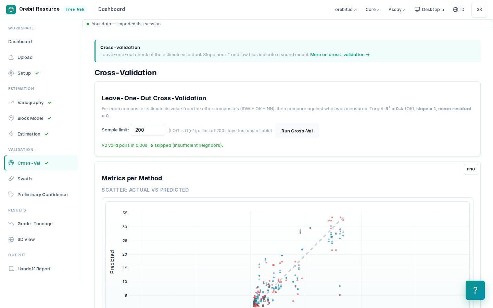

| | OK | IDW | NN |
|---|---:|---:|---:|
| Slope regresi (prediksi terhadap aktual) | **0,75** | 0,77 | 0,82 |
| r² | 0,75 | 0,75 | 0,71 |
| Bias rata-rata (prediksi − aktual) | **+0,08** | +0,24 | +0,19 |
| RMSE | 4,60 | 4,62 | 5,07 |

Cara membaca: OK **tidak bias secara global** (+0,08 % Zn dari rata-rata 8,43 %), tetapi **bias bersyarat**. Slope 0,75 berarti kadar tinggi diremehkan dan kadar rendah dilebih-lebihkan. Ini perataan (*smoothing*) yang diharapkan bila range korelasi lebih pendek dari jarak antar lubang (§7). Akibatnya kurva grade-tonnage **pada cut-off tinggi** harus dibaca hati-hati: tonase di atas cut-off tinggi cenderung terlalu besar dengan kadar terlalu rendah. Slope ≥ 0,8–0,9 biasanya dicari untuk estimasi yang dipakai membuat keputusan per blok.

---

## 10. Skrining keyakinan dan grade-tonnage

### Skrining keyakinan

Tab **Preliminary Confidence** membagi 209 blok berdasarkan jarak ke data dan jumlah lubang:

| Tingkat | Blok |
|---|---:|
| Keyakinan tinggi | 39 |
| Keyakinan sedang | 72 |
| Keyakinan rendah | 98 |

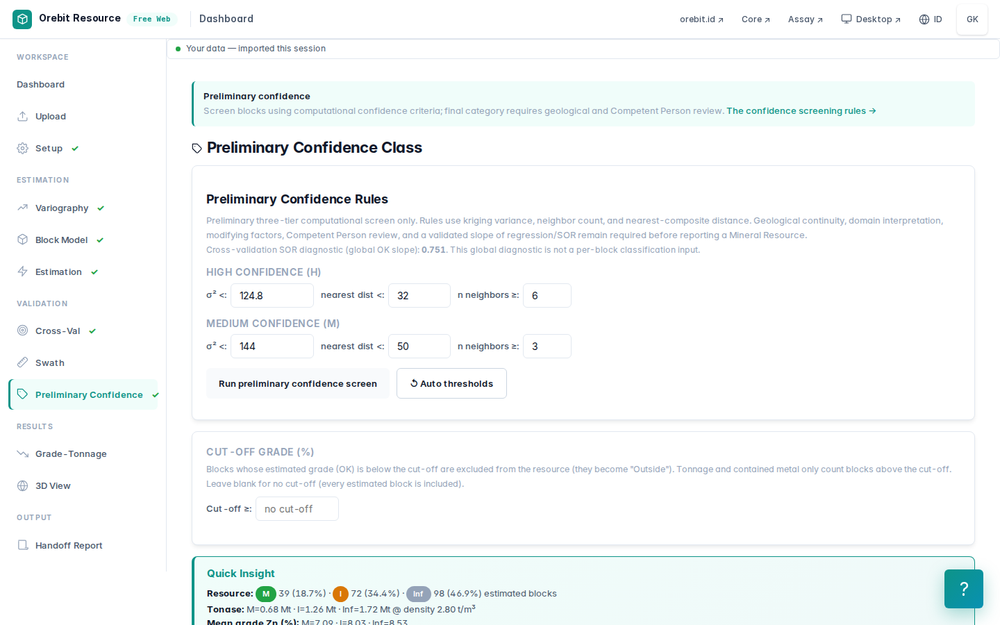

Ini **skrining komputasi**, bukan klasifikasi *Measured / Indicated / Inferred*. KCMI 2017 dan JORC 2012 tidak menetapkan ambang numerik. Klasifikasi adalah keputusan tertulis seorang *Competent Person* yang menimbang geologi, QAQC, densitas, dan kontinuitas. Karena itulah GeoSuite sengaja tidak memakai istilah itu.

Satu hal yang layak dicatat: kadar rata-rata blok berkeyakinan tinggi + sedang (**7,70 %**) **lebih rendah** daripada semua blok (8,09 %). Kadar tertinggi berada di blok yang paling jauh dari data, pola klasik ekstrapolasi. Itu alasan lain untuk curiga pada angka di cut-off tinggi.

### Grade-tonnage, diperiksa independen

Kurva di tab **Grade-Tonnage** dihitung oleh aplikasi. Tabel di bawah dihitung **ulang secara independen** dari model blok yang diekspor (`exportBlockCSV`), dengan Python biasa, lalu dibandingkan dengan kurva aplikasi. `test_vignettes.py` menggagalkan build bila keduanya berselisih.

| Cut-off Zn | Tonase (Mt) | Kadar Zn | Logam Zn (kt) | Hanya tinggi + sedang: Mt @ % |
|---|---:|---:|---:|---|
| 0 / 1 % | 3,658 | 8,09 % | 295,8 | 1,943 @ 7,70 |
| 2 % | 3,465 | 8,44 % | 292,6 | 1,820 @ 8,10 |
| 3 % | 2,590 | 10,47 % | 271,1 | 1,295 @ 10,38 |
| 5 % | 2,188 | 11,76 % | 257,2 | 1,085 @ 11,73 |
| 8 % | 1,768 | 13,00 % | 229,9 | 0,858 @ 13,02 |

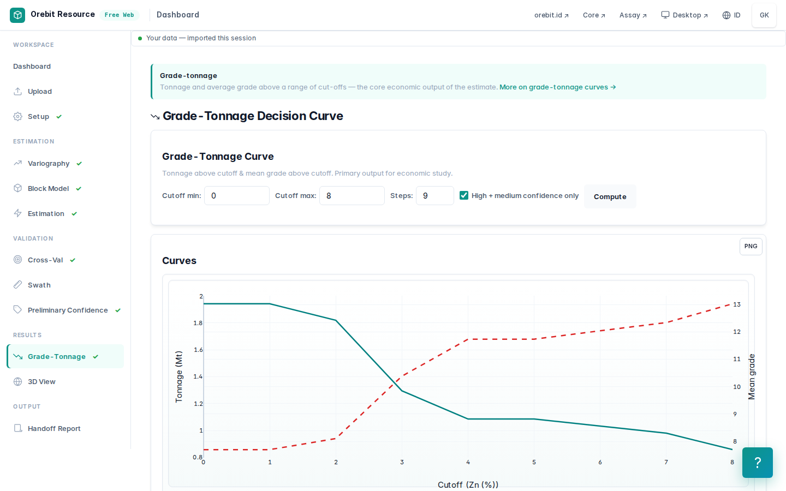

---

## 11. Densitas: satu angka yang mengubah tonase ±30 %

Tab **KCMI** menampilkan dasar densitas sebagai:

> *ASSUMED uniform default — not measured. Enter the deposit's measured SG before reporting tonnage.*

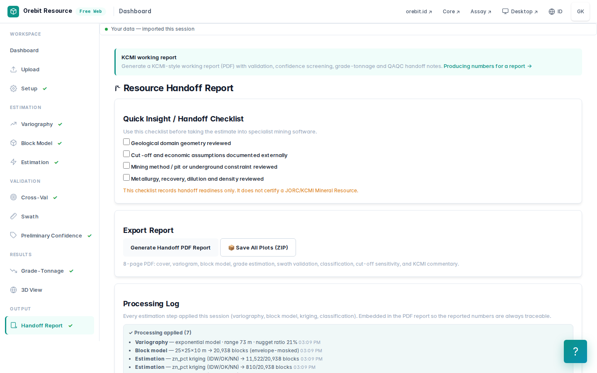

Bijih sulfida masif dengan sfalerit, galena, dan pirit umumnya memiliki densitas **3,2–4,0 t/m³**, bukan 2,8. Karena tonase berbanding lurus dengan densitas, memakai 2,8 bisa **meremehkan tonase bijih sulfida masif hingga ±30 %**, sementara pada zona stringer / disseminasi 2,8 mungkin wajar. Densitas harus diukur, per domain atau diregresikan terhadap kadar Fe+S+Zn+Pb. Tanpa itu tonase belum layak dilaporkan.

Untuk skala: 209 blok yang sama dengan densitas **3,6 t/m³** memberi **4,702 Mt**, bukan 3,658 Mt.

---

## 12. Uji kewajaran terhadap produksi historis

| | Tonase | Zn |
|---|---:|---:|
| **Produksi 1989–1998** | **4,7 Mt** | **8,3 %** |
| Percobaan A: tanpa batas domain | 202 Mt | 5,88 % |
| Percobaan A2: batas domain, pencarian bawaan | 14,2 Mt | 7,38 % |
| Percobaan B: batas domain + pencarian geologis (2,8 t/m³) | 3,7 Mt | 8,09 % |
| Percobaan B dengan densitas sulfida masif 3,6 t/m³ | 4,7 Mt | 8,09 % |
| Percobaan B, hanya keyakinan tinggi + sedang | 1,9 Mt | 7,70 % |

**Kadar** hanya berselisih sekitar 3 % dari kadar yang ditambang. **Tonase** 78 % dari produksi pada densitas asumsi, dan praktis sama pada densitas sulfida masif yang wajar.

**Jangan terlalu cepat senang.** Kecocokan ini sebagian kebetulan, dan geologis senior harus mengatakannya:

1. **Produksi bukan sumber daya.** Tambang menambang sebagian endapan pada cut-off ekonomi dengan dilusi (menurunkan kadar), lalu tutup karena alasan ekonomi. Endapan ini kemudian dikembangkan kembali, yang berarti mineralisasi tersisa setelah 1998.
2. **Orientasi yang tidak terselesaikan.** Elipsoid horizontal pada lensa yang kemiringannya tidak diketahui bisa menaruh volume di tempat yang salah meski totalnya kebetulan mendekati.
3. **Batas domain berasal dari satu cut-off (1 % Zn).** Ubah ke 0,5 % atau 2 % dan tonase bergeser. Tanpa wireframe litologi, volume ini tetap bergantung pada keputusan itu.

Kesimpulan yang jujur: dengan batas domain dan pencarian yang dibatasi geologi, 13 lubang tanpa litologi menghasilkan **orde besaran, kadar, dan tonase yang masuk akal** terhadap sejarah tambang. Tetapi **volume dan klasifikasinya tetap belum dapat dipertanggungjawabkan untuk dilaporkan**. Inilah fungsi skrining: memberi tahu *apa yang harus dikerjakan berikutnya*, bukan menggantikannya.

---

## 13. Ini bukan Sumber Daya Mineral. Yang dibutuhkan untuk menjadi Sumber Daya Mineral:

- [ ] **Logging litologi dan model geologi 3D** lensa sulfida masif / stringer / batuan samping, sebagai pengganti *grade shell*;
- [ ] **Orientasi lensa** yang terselesaikan (penampang terinterpretasi, data struktur, atau pengeboran tambahan);
- [ ] **Densitas terukur** per domain;
- [ ] **QAQC**: standar (CRM), blanko, dan duplikat untuk kampanye yang dipakai, sertifikat laboratorium, termasuk resolusi **Au 1.380 g/t TH35**;
- [ ] **Verifikasi survey collar dan downhole** (sistem koordinat, metode survey);
- [ ] Penanganan **interval tanpa sampel** yang diputuskan geologis;
- [ ] Validasi *swath plot*, rekonsiliasi terhadap produksi historis dan terhadap tambang (void) yang sudah ada;
- [ ] Klasifikasi dan laporan oleh **Competent Person** sesuai KCMI 2017 / JORC 2012.

---

## Coba sendiri

1. Ubah cut-off domain ke **0,5 %** dan **2 %**. Perhatikan berapa logam yang masuk dan keluar dari domain, dan bagaimana CV di dalam domain berubah.
2. Matikan **Keep blocks inside the domain** pada Percobaan B. Berapa tonase yang bertambah, dan di mana letak blok-blok tambahan itu?
3. Jalankan ulang Percobaan B dengan **minimal 2 komposit** dan **octant search** aktif. Blok mana yang berubah paling banyak?
4. Naikkan r Semi ke 100 m, lalu lihat hasil validasi silang dan rasio OK/NN.

## Mengulang vignette ini

```bash
node build/build.mjs                                   # build Core/Assay/Resource ke dist/
python3 docs/vignettes/tools/run_thalanga.py           # ±90 detik; tulis data/thalanga.json + img/
python3 docs/vignettes/tools/run_thalanga.py --no-shots  # tanpa tangkapan layar
```

Skrip menggerakkan build aplikasi yang sama dengan yang dipakai pengguna, di Chromium, langkah demi langkah seperti di atas. Angka kunci dihitung ulang dari file ekspor secara independen.

## Atribusi

Data: © State of Queensland (Geological Survey of Queensland), *NEQ Deposit Atlas – Thalanga* (ds100103), dilisensikan di bawah [CC BY 4.0](https://creativecommons.org/licenses/by/4.0/). Data dimuat sebagaimana dipublikasikan. Satu-satunya perubahan adalah dua penghapusan dan satu pengosongan nilai yang dijelaskan di §3, dan ketiganya tercatat di CHANGE_LOG. Batas area (`thalanga-deposit-area.geojson`) adalah buatan vignette ini. Angka produksi historis: mining-technology.com, *Thalanga Zinc Project, Queensland*.
