# Vignette 01 — Thalanga (VMS Zn-Pb-Cu-Ag-Au): dari data publik mentah ke skrining sumber daya yang bisa dipertanggungjawabkan

Contoh pembanding yang dapat direproduksi ini memakai **envelope screening XY** secara eksplisit di Block Model → Advanced. Proyek baru memakai kedekatan sampel 3D; pilih XY untuk mengulang angka di bawah. Kedua envelope bukan solid geologi tertutup.

> **English:** [en/01-thalanga-vms.md](en/01-thalanga-vms.md)

| | |
|---|---|
| **Data** | *NEQ Deposit Atlas – Thalanga* (ds100103), Geological Survey of Queensland, **CC BY 4.0** — <https://geoscience.data.qld.gov.au/dataset/ds100103>. Tutorial mengimpor empat tabel publik; contoh bawaan aplikasi adalah nickel sintetis. |
| **Modul** | Core → Assay → Resource |
| **Waktu** | ±45 menit bila diikuti manual |
| **Hasil akhir** | Skrining *grade-tonnage*, lengkap dengan daftar alasan mengapa hasil ini **belum** Sumber Daya Mineral |
| **Bisa diulang** | `node build/build.mjs && python3 docs/vignettes/tools/run_thalanga.py` — seluruh angka di halaman ini dibaca dari [`data/thalanga.json`](data/thalanga.json) yang ditulis skrip itu, dan `test_vignettes.py` menggagalkan build bila aplikasi mulai menghasilkan angka lain. |

Vignette ini sengaja tidak memakai data "bersih" buatan. Data kompilasi pemerintah seperti ini persis yang sering diterima geologis eksplorasi di dunia nyata: ratusan lubang dari banyak perusahaan dan banyak dekade, kode laboratorium yang berganti-ganti, lubang geokimia dangkal bercampur lubang intan dalam. Tujuannya bukan menghasilkan angka yang indah, tetapi menunjukkan **setiap keputusan** yang harus diambil geologis, **alasannya**, dan **apa yang terjadi bila keputusan itu dilewati**.

---

> **Pembaruan perhitungan, 7 Oktober 2026:** rekaman ini memakai range fisik hasil fit untuk covariance scalar. Radius pencarian memilih neighbour; tidak lagi menggantikan range model. Tabel dan screenshot UI direkam ulang dari upload CSV; grade-tonnage ekspor dihitung ulang independen. Session historis perlu di-refit untuk memakai mode yang dikoreksi.

## 0. Konteks geologi dan patokan pembanding

Thalanga adalah endapan sulfida masif vulkanogenik (VMS) Zn-Pb-Cu-Ag-Au di Mount Windsor Subprovince, ±65 km barat daya Charters Towers, Queensland. Tambang bawah tanahnya berproduksi **1989–1998** dan menghasilkan **4,7 Mt @ 8,3 % Zn, 2,6 % Pb, 1,9 % Cu** ([mining-technology.com](https://www.mining-technology.com/projects/thalanga-zinc-project-queensland/)).

Angka produksi itulah patokan kita. Jangan pernah menilai sebuah estimasi hanya dari "apakah program selesai tanpa error". Tanyakan: *apakah hasilnya masuk akal dibanding sesuatu yang diketahui secara independen?* Di akhir (§12) kita membandingkan hasil skrining dengan patokan ini dan menjelaskan selisihnya.

Satu batasan sejak awal: data ini **tidak memuat logging litologi untuk lubang-lubang bor intan di endapan utama**. Tanpa litologi tidak ada model geologi. Itu membatasi segalanya setelahnya, dan kita akan melihat akibatnya dengan jelas.

---

## 1. Memuat data (Core)

Buka **Orebit Core** lalu impor empat CSV Thalanga. Runner membuat CSV dari [fixture publik](https://github.com/ghoziankarami/geosuite/blob/main/tests/fixtures/thalanga-core.json); data contoh bawaan tetap nickel sintetis.

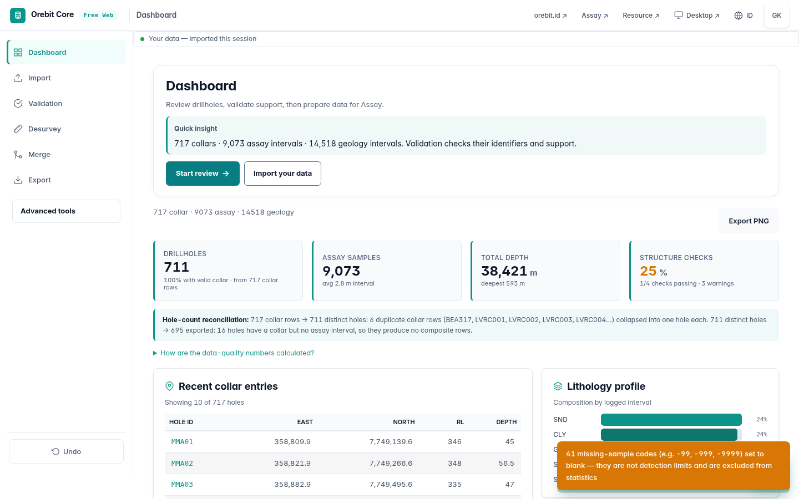

| Tabel | Baris |
|---|---:|
| Collar | 717 |
| Survey | 667 |
| Assay | 9.073 |
| Geology | 14.518 |

Sebelum melihat peta, lihat dulu **jenis lubangnya**:

| Tipe bor | Jumlah lubang |
|---|---:|
| BEDRK (geokimia batuan dasar, dangkal) | 520 |
| REVC (RC) | 55 |
| PERC (perkusi) | 45 |
| RAB | 39 |
| ACORE | 21 |
| TCH (paritan) | 19 |
| DD (bor intan) | 18 |

**Pelajaran pertama:** ini kompilasi regional, bukan basis data bor sebuah endapan. Tiga perempat lubangnya adalah lubang geokimia dangkal untuk mencari anomali, bukan untuk mengukur tonase. Kalau semua lubang ini dicampur ke dalam estimasi, ratusan sampel "latar belakang" dari puluhan kilometer jauhnya ikut mempengaruhi statistik dan variogram. Langkah pemotongan (§4) ada karena alasan ini.

---

## 2. Kode kadar laboratorium: angka negatif bukan angka

Data assay lama memakai angka negatif sebagai kode, dan artinya berbeda-beda antar laboratorium dan antar dekade. Core mendeteksinya saat impor dan menerapkan satu aturan yang terdokumentasi (`src/shared/io/grades.js`):

- **nilai negatif biasa** (−0,01; −5; −0,0001) → *di bawah batas deteksi*, dipakai **setengah** batas deteksi;
- **kode "semua sembilan"** (−999, −9999 …) **atau** nilai negatif yang besarnya melampaui nilai positif maksimum kolom itu → **data hilang** (kosong), karena mustahil ada batas deteksi yang lebih tinggi daripada kadar tertinggi yang pernah diukur;
- **`>X`** (di atas batas atas) → X, dan ditandai.

Hasilnya pada Thalanga: **2.428** nilai di bawah batas deteksi dan **41** kode data hilang.

| Kolom | < batas deteksi | Kode hilang | Nilai positif maks. |
|---|---:|---:|---:|
| au_gpt | 1.223 | 0 | 1.380 |
| ag_gpt | 578 | 19 | 9.560 |
| s_pct | 485 | 7 | 5 |
| cu_ppm | 68 | 0 | 114.200 |
| pb_ppm | 68 | 15 | 248.000 |
| zn_ppm | 6 | 0 | 406.000 |

Mengapa ini penting: kolom Pb berisi kode **−995.000** dan Ag **−9.910.000**. Program yang memperlakukan setiap angka negatif sebagai "setengah batas deteksi" akan memberi sampel-sampel itu kadar Pb 49 % dan Ag 4.955 g/t, yaitu 15 bonanza palsu. Program yang memperlakukannya sebagai nol, atau membuangnya diam-diam, menurunkan rata-rata tanpa jejak. Aturan batas maksimum di atas membedakan kedua kasus tanpa perlu tebakan per laboratorium, dan **Au 1.223 nilai deteksi-batas dari beberapa era** (−0,01; −0,05; −0,0001) tetap diperlakukan dengan benar sebagai nilai rendah yang nyata.

> Periksa sendiri: di tab **Validation** Core, baris *Below-detection (negative) grade values* menunjukkan **0** setelah impor. Itu bukan berarti datanya bersih. Artinya semua kode sudah diterjemahkan dan dicatat.

---

## 3. Validasi: temukan, putuskan, catat

Tab **Validation** Core menjalankan 23 pemeriksaan pada empat tabel ini.

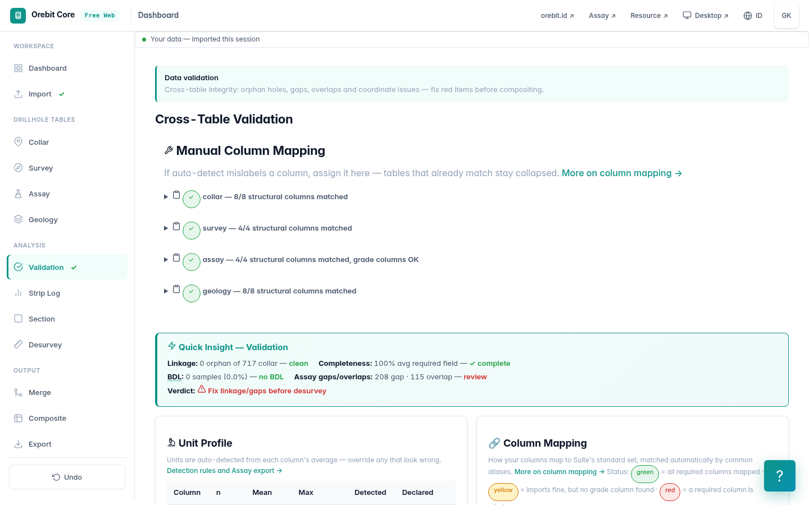

| Pemeriksaan | Sebelum | Sesudah perbaikan |
|---|---|---|
| Collar tanpa survey (dianggap vertikal) | 259 lubang ⚠ | 259 ⚠ |
| Collar tanpa assay | 16 lubang ⚠ | 16 ⚠ |
| Collar tanpa geologi | 381 lubang ⚠ | 381 ⚠ |
| **hole_id collar ganda** | **6 ✗** | 6 ✗ |
| Celah (gap) interval assay | 208 ⚠ | 206 ⚠ |
| **Tumpang tindih (overlap) interval assay** | **115 ✗** | 113 ✗ |
| **Pengukuran survey tidak valid** | **1 ✗** | **1 ✗** |
| Keputusan keterkaitan | **FIX REQUIRED** | **FIX REQUIRED** |

Apa isi temuan itu (diperiksa baris demi baris):

- **6 collar ganda.** LVRC001–LVRC005 tercatat dua kali, di bawah dua program berbeda (RGMWP dan TCLV), dengan selisih koordinat 1–5 cm. Ini lubang yang sama, dikompilasi dua kali. BEA317 tercatat sebagai ACORE dan BEDRK.
- **115 overlap.** Umumnya sampel ulang atau komposit lapangan yang ikut dikompilasi. Contoh: TCRC11 berisi interval 4–5 m *dan* komposit 4–8 m.
- **259 lubang tanpa survey** akan dianggap vertikal. Semuanya lubang dangkal (236 BEDRK, 20 perkusi, 3 RC; median kedalaman 36 m, terdalam 150 m), jadi efeknya kecil. Pada lubang dalam, anggapan ini fatal (§4).
- **381 lubang tanpa geologi, termasuk semua lubang bor intan di endapan.**

### Dua perbaikan yang dilakukan, dan mengapa hanya dua

1. **Dua spot sample di TH37** (190,0–190,2 m dan 490,0–490,2 m, ID sampel `TH37190`, `TH37490`) berada sepenuhnya *di dalam* interval yang lebih panjang di lubang yang sama. Ini sampel cek yang ikut terkompilasi. Keduanya dihapus, karena kalau dibiarkan interval yang sama terhitung dua kali.
2. **Au 1.380 g/t di TH35 100,0–100,2 m.** Nilai tertinggi berikutnya di seluruh dataset hanya 1,69 g/t, sekitar 800× lebih kecil. Pada interval yang sama Ag hanya 1 g/t dan Zn 1.210 ppm. Bonanza emas tanpa perak dan tanpa logam dasar di sistem VMS secara geologi tidak masuk akal; yang paling mungkin adalah salah satuan atau salah koma. **Nilai itu dikosongkan, bukan "dikoreksi" menjadi 1,38.** Kita tidak menebak isi sertifikat laboratorium. Kosongkan, catat, dan minta sertifikat aslinya.

Keduanya dilakukan di editor data Core dan tercatat otomatis di **CHANGE_LOG**:

```
assay: 1 rows edited, 0 added, 2 deleted
```

CHANGE_LOG lengkap tersimpan dalam proyek Core dan PDF. CSV cropped mencatat scope validasi dan merujuk audit tersebut; seluruh riwayat edit tidak disimpan di CSV.
Audit ini menyimpan 33 perubahan sel: satu nilai Au yang dikosongkan dan 32 field asli dari dua record yang dihapus. Field kosong ikut dicatat agar isi record asal dapat ditelusuri.

### Mengapa status tetap "FIX REQUIRED", dan itu benar

Sisa masalah (collar ganda LVRC/BEA, ratusan overlap TCRC dan dip tidak valid TH38) semuanya berada di **lubang regional di luar area endapan**. Geologis senior tidak "membersihkan" data yang tidak akan dipakai hanya supaya lampu indikator hijau. Data itu **dikeluarkan secara eksplisit** lewat batas area (§4), dan alasannya ditulis. Status merah di sini adalah catatan yang jujur, bukan kegagalan.

---

## 4. Desurvey dan pemotongan ke area endapan

### Desurvey

Tab **Desurvey** mendeteksi konvensi dip dari data: `positive_down`, yaitu dip positif berarti ke bawah. Inventaris mencakup 711 lubang dan 33 temuan survey: 32 arah berbeda pada MD yang sama, ditambah TH38 pada MD416 m memiliki dip132°. Jejak TH38 ditahan; pengukuran tidak ditebak atau diubah. TH38 tidak termasuk 13 lubang ekspor area.

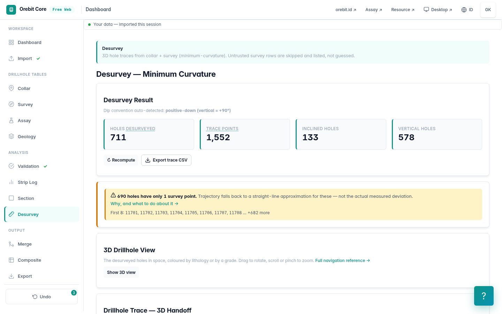

Lubang-lubang intan di Thalanga **melandai sangat kuat** ke arah dasarnya:

| Lubang | Kedalaman akhir | Elevasi dasar lubang (z) |
|---|---:|---:|
| TH1 | 257 m | 140,9 m |
| TH5 | 395,9 m | 117,2 m |
| TH40 | 593,3 m | −103,1 m |

TH5 sepanjang hampir 400 m hanya turun sekitar 180 m dan berakhir hampir horizontal. Seandainya survey diabaikan dan lubang dianggap vertikal, setiap sampel di bagian bawah TH5 akan diletakkan ratusan meter terlalu dalam dan puluhan meter dari posisi sebenarnya. Estimasi blok yang dibangun di atas posisi itu salah secara spasial, tanpa ada satu pun pesan error.

### Pemotongan (crop) ke area endapan

Karena tidak ada logging litologi di lubang endapan, kita tidak bisa membangun *wireframe* geologi. Batas yang bisa dipertanggungjawabkan adalah **kotak area endapan** yang dibatasi secara eksplisit di sekitar lubang-lubang seri TH (MGA zona 55):

```
X 370.200 – 372.900 m   Y 7.750.000 – 7.750.800 m
```

File: [`data/thalanga-deposit-area.geojson`](data/thalanga-deposit-area.geojson). Muat di tab **Crop to Constraint**.

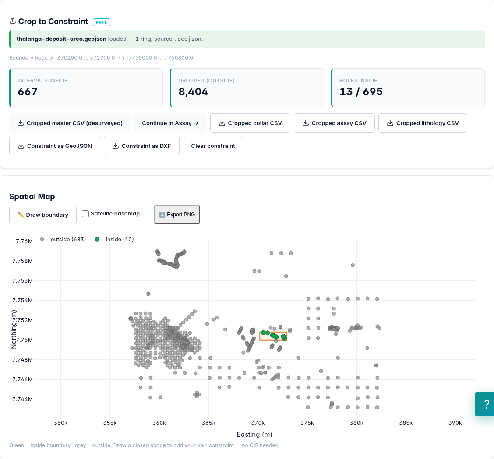

| | |
|---|---:|
| Interval di dalam | **667** dari 9.071 |
| Interval dibuang | 8.404 |
| Lubang di dalam | **13** dari 695 |

Perhatikan: peta menunjukkan **12 collar** di dalam kotak, tetapi **13 lubang** menyumbang interval. Core memotong berdasarkan **posisi titik tengah interval yang sudah ter-desurvey**, bukan posisi collar. Satu lubang di-collar di luar kotak tetapi menembus ke dalamnya. Pemotongan berbasis collar akan kehilangan interval itu.

Lubang yang tersisa: TE-1, TE-2, TH1, TH2, TH3, TH4, TH5, TH6, TH31, TH35, TH37, TH39, TH40. Ke-13 lubang ini (11 bor intan, 2 perkusi) semuanya punya survey, tidak ada yang termasuk collar ganda, dan satu-satunya overlap di dalamnya adalah dua spot sample TH37 yang sudah dihapus di §3. Ekspor **Cropped master CSV (desurveyed)** untuk langkah berikutnya. Jalur ini memvalidasi interval terpilih serta collar, survey dan geologi lubangnya; kegagalan di dalam pilihan menahan ekspor. Scope tercatat pada header CSV dan riwayat pipeline, sementara temuan regional tetap tersimpan.

---

## 5. Kenali populasinya sebelum memutuskan apa pun

Sebelum masuk ke Assay, statistik 667 sampel ini dihitung **terpisah dari aplikasi** (Python murni, langsung dari CSV hasil ekspor):

| Zn (%) | |
|---|---:|
| Rata-rata | 2,245 |
| Median | 0,2 |
| Koefisien variasi (CV) | **2,66** |
| P95 / P99 / maks. | 15,1 / 31,2 / 40,6 |
| Panjang sampel median / modus | 0,7 m / 1,0 m |

Rata-rata sebelas kali median, dengan CV 2,66. Distribusi seperti ini bisa berarti dua hal yang penanganannya sangat berbeda:

- **satu populasi dengan beberapa pencilan** → diperlakukan dengan *top-cut*;
- **campuran dua populasi** (bijih sulfida masif dan batuan samping) → diperlakukan dengan **domain**.

Uji sederhana yang membedakannya adalah melihat di mana logamnya berada:

| Sampel dengan Zn ≥ | Bagian logam Zn total |
|---|---:|
| 0,5 % | 95,7 % |
| 1 % | **91,7 %** |
| 2 % | 87,0 % |
| 5 % | 74,6 % |

Lalu pisahkan pada 1 % Zn:

| | n | Rata-rata Zn | CV |
|---|---:|---:|---:|
| ≥ 1 % (di dalam *shell*) | 170 | 8,26 % | **1,15** |
| < 1 % (di luar) | 497 | 0,187 % | 1,26 |

CV turun dari 2,66 menjadi 1,15 begitu kedua populasi dipisah. **Variabilitas tinggi itu berasal dari campuran populasi, bukan dari pencilan.** Kesimpulan ini menentukan dua keputusan berikutnya: *jangan* memangkas kadar tinggi, dan *pisahkan* domain.

---

## 6. Assay: pilih komoditas, uji top-cut, bangun domain

Unggah master CSV hasil crop ke **Orebit Assay**. Assay mengenali satuan dari nama kolom dan mengonversi `zn_ppm`, `pb_ppm`, `cu_ppm` menjadi persen (÷ 10.000). Konversi itu ditampilkan, tidak dilakukan diam-diam.

### Pilih komoditas utama

Secara bawaan Assay mengambil kolom kadar pertama, yaitu **cu_pct**. Untuk endapan seng, itu keliru. Pilih **zn_pct** di pemilih **Commodity**. Pilihan ini berlaku untuk validasi, domain, QAQC, laporan, dan PDF.

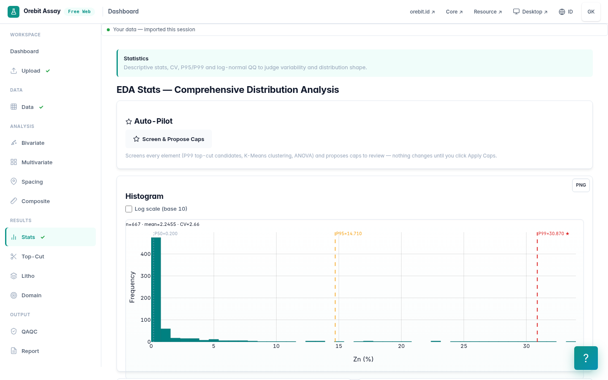

### Top-cut: diuji, lalu sengaja tidak dipakai

Tab **Top-Cut** mencari titik *disintegrasi*, yaitu tempat ekor distribusi mulai terputus-putus. Pada Zn titik itu ada di **27,5 %** (persentil 98,1).

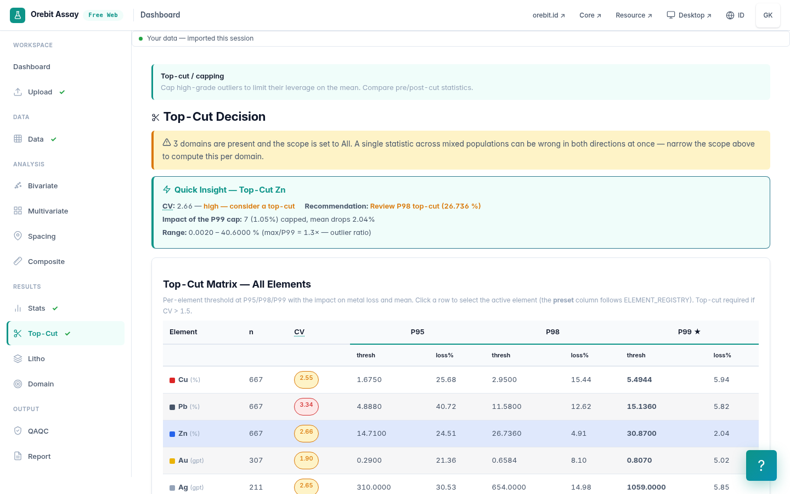

**Keputusan: tidak ada top-cut untuk Zn.** Alasannya:

1. §5 menunjukkan variabilitas berasal dari campuran populasi. Di dalam domain mineralisasi CV hanya 1,15, jauh di bawah ambang yang biasanya membuat geologis mempertimbangkan pemangkasan (sekitar 1,5–2).
2. Zn 27–40 % adalah sulfida masif kaya sfalerit, **populasi nyata** yang memang ditambang di sini. Memangkasnya ke 27,5 % berarti menghapus logam nyata dari bijih terbaik.
3. Top-cut dipakai untuk membatasi pengaruh *sedikit* sampel ekstrem terhadap *banyak* blok. Masalah itu ditangani lebih baik oleh strategi pencarian (§8).

Keputusan tidak memangkas sama pentingnya dengan keputusan memangkas, dan **harus ditulis** di laporan beserta alasannya.

### Domain: *grade shell* 1 % Zn, karena tidak ada litologi

Tab **Domain** → metode **Grade shell (cut-off)**, cut-off **1** (% Zn).

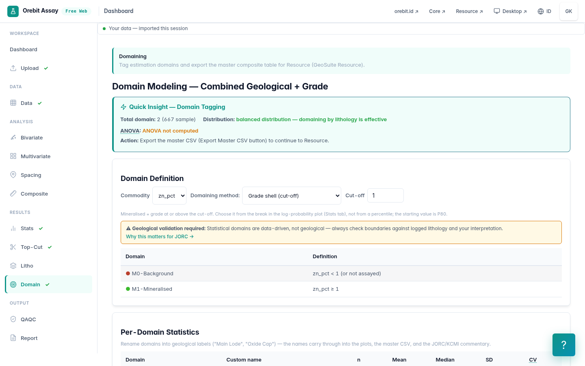

| Domain | Sampel |
|---|---:|
| M1-Mineralised (Zn ≥ 1 %) | 170 |
| M0-Background (Zn < 1 % atau tidak dianalisis) | 497 |

Mengapa 1 %: angka itu menangkap 91,7 % logam (§5), memisahkan dua populasi dengan CV yang wajar, dan cukup rendah sehingga tidak "memotong" bijih. Cut-off *domain* bukan cut-off *ekonomi*. Ia memisahkan populasi, bukan menentukan apa yang layak ditambang.

**Keterbatasan yang harus diakui:** *grade shell* bukan domain geologi. Ia dibentuk oleh kadar itu sendiri, sehingga cenderung terlalu optimistis di tepi (sampel rendah di antara sampel tinggi ikut dibuang) dan tidak tahu apa-apa tentang kontak litologi atau struktur. Dengan logging litologi, domain seharusnya dibangun dari kontak sulfida masif / stringer / batuan samping. Karena datanya tidak ada, kita memakai *grade shell* dan menulis keterbatasan ini.

### Kompositing 1 m

Tab **Composite**, panjang **1 m** (modus panjang sampel).

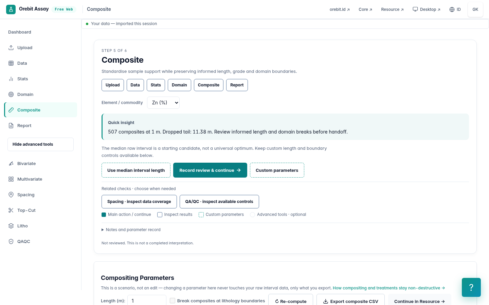

| | |
|---|---:|
| Komposit | **507** (M1: 98, M0: 409) |
| Sampel nyata yang terbuang (ekor < panjang minimum) | 11,38 m |
| Panjang lubang tanpa sampel sama sekali | 1.112 m |
| Overlap | 0 |
| Komposit yang < 50 % terisi sampel nyata | 77 |

Core memperlakukan interval tanpa sampel sebagai **tidak diketahui**, bukan nol. Pada data kompilasi, interval yang tidak dianalisis biasanya *dianggap* barren oleh pengebor, tetapi anggapan itu harus diputuskan geologis, bukan program. Setiap komposit membawa kolom `coverage`. Peringatan kuning di layar menandai **77 komposit** yang kurang dari separuhnya berisi sampel nyata. Periksa itu sebelum estimasi.

Ekspor **Export composite CSV** (`exportMasterForEstimation`). File itu sudah membawa koordinat, domain, dan kadar dalam persen.

---

## 7. Variogram dan grid

Buka Variography, hitung Downhole lebih dulu, lalu Compute dan Auto-fit. Nugget ditahan pada nilai downhole. Range yang berada di batas pencarian fitting bukan ukuran kontinuitas yang telah terbukti.

| Parameter | Hasil |
|---|---:|
| Downhole pairs | 840 |
| Nugget (%²) | 22,2 |
| First between-hole lag γ (%²) | 77,4 |
| Sill (%²) | 104,0 |
| Range (m; rangeMin flag) | 72,5 |
| Median hole spacing (m) | 90 |
| Block size (m) | 25 ×25 ×10 |
| Generated screening cells | 20.967 |

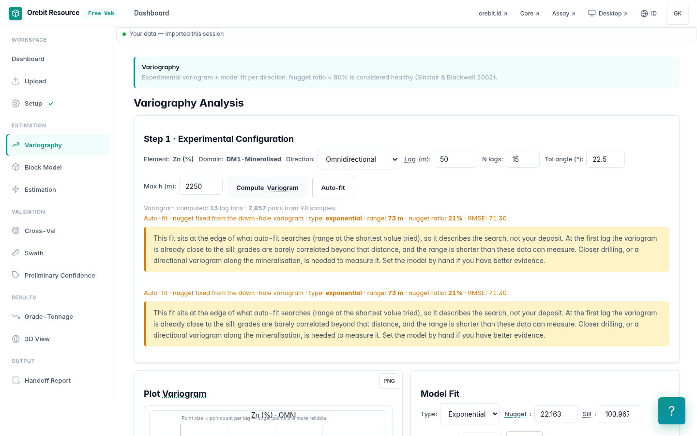

Sel bukan seluruh kotak bounding-box. Support dan penugasan domain sampel membatasi populasi. Default densitas 2,8 t/m³ adalah ASUMSI, bukan hasil pengukuran.

## 8. Bandingkan keputusan estimasi

Ketiga percobaan memakai komposit dan variogram yang sama. Batas kategorikal nearest-neighbour bukan solid geologi. Radius pencarian berbeda dari buffer support.

| Percobaan | OK cells | Model mass (Mt) | Mean Zn (%) |
|---|---:|---:|---:|
| A: no categorical boundary | 11.527 | 202 | 5,85 |
| A2: default search + boundary | 833 | 14,6 | 7,16 |
| B: reviewed search + boundary | 221 | 3,867 | 7,83 |

A2: 20.129 sel dalam jangkauan ditolak oleh batas kategorikal.

Parameter B tetap: major100 m, semi50 m, minor25 m, azimut98°, dip0°, minimum4/maksimum12 komposit. Pilihan ini membatasi pengaruh pada arah yang belum terukur; orientasi lensa belum dapat ditentukan hanya dari lubang ini.

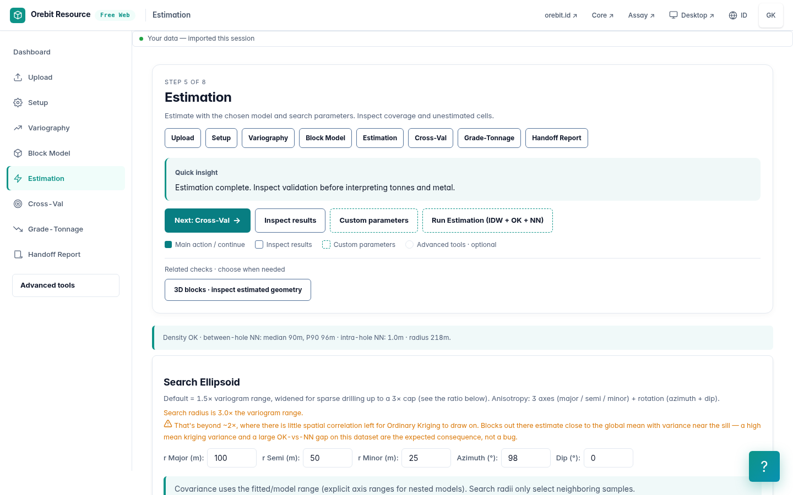

| Method | Mean Zn (%) |
|---|---:|
| OK | 7,83 |
| IDW | 8,44 |
| NN | 8,45 |

NN berbeda sekitar 8,0 % dari OK. Tinjau clustering dan rata-rata declustered; selisih bukan sertifikasi akurasi.

## 9. Cross-validation

Leave-one-out: 92 pairs.

| Method | Slope | r² | Bias | RMSE |
|---|---:|---:|---:|---:|
| OK | 0,73 | 0,73 | 0,08 | 4,72 |
| IDW | 0,77 | 0,75 | 0,24 | 4,62 |
| NN | 0,82 | 0,73 | -0,12 | 4,84 |

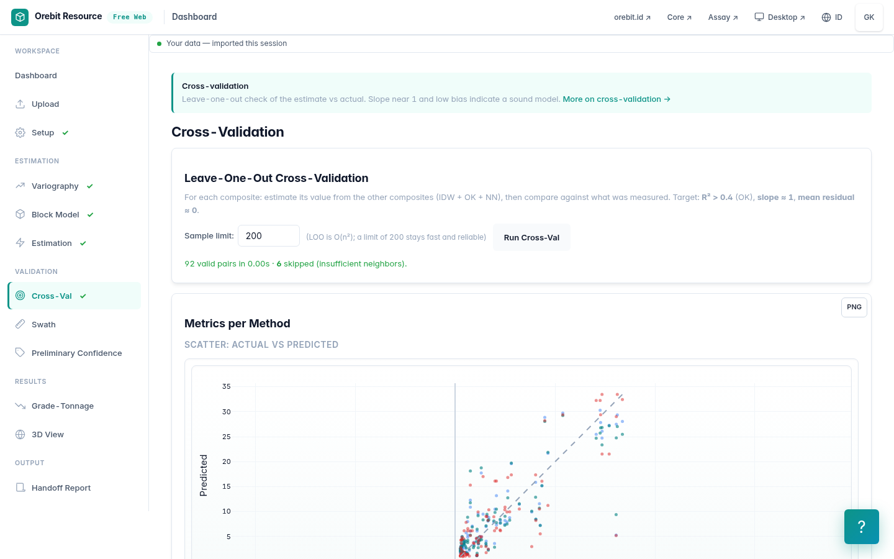

Slope di bawah 1 menunjukkan smoothing. Bias kecil pada rata-rata tidak menjamin kadar tiap blok benar; inspeksi error terhadap kadar dan posisi sebelum keputusan per blok.

## 10. Keyakinan dan grade-tonnage

High: 48; medium: 86; low: 87. Ini screening komputasi, bukan klasifikasi Measured/Indicated/Inferred atau keputusan CP.

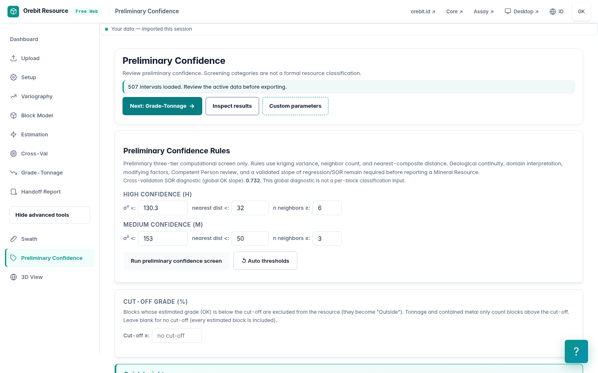

Tabel dihitung independen dari CSV blok OK. Pembulatan 0,001 Mt dapat berbeda antara Python dan tampilan aplikasi; tes membandingkan dengan toleransi pembulatan yang sama, tanpa mengubah metode.

| Cutoff Zn (%) | Mass (Mt) | Zn (%) | Metal (kt) | High+medium Mt @ % |
|---|---:|---:|---:|---|
| 0 | 3,867 | 7,83 | 302,8 | 2,345 @ 7,82 |
| 1 | 3,867 | 7,83 | 302,8 | 2,345 @ 7,82 |
| 2 | 3,692 | 8,12 | 299,8 | 2,240 @ 8,10 |
| 3 | 2,765 | 10,00 | 276,5 | 1,715 @ 9,80 |
| 5 | 2,205 | 11,64 | 256,7 | 1,365 @ 11,43 |
| 8 | 1,837 | 12,69 | 233,2 | 1,155 @ 12,30 |

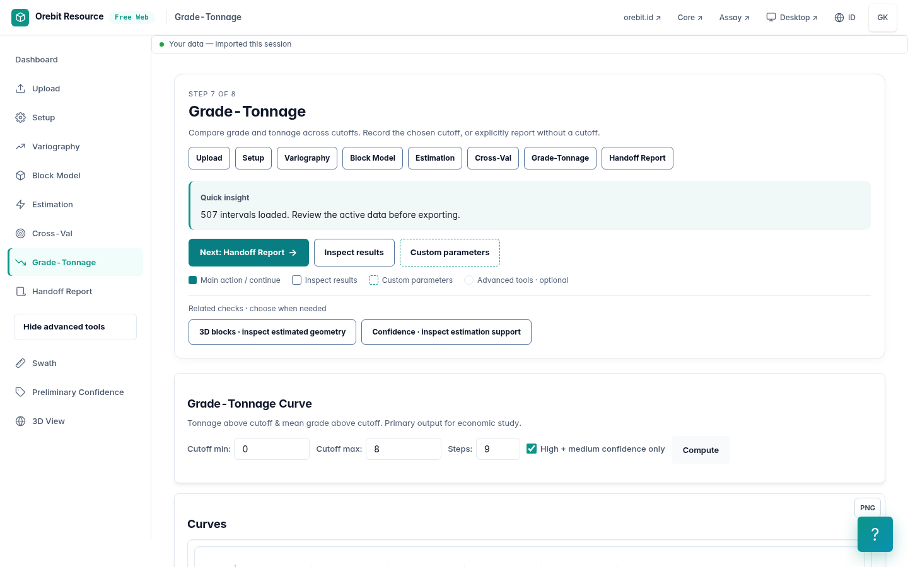

## 11. Densitas dan geometri

221 cells × 6.250 m³ × 2,8 t/m³ = 3,867 Mt. Zn metal: 302,8 kt.

Mengganti hanya densitas menjadi3,6 t/m³ memberi 4,973 Mt. Densitas sulfida harus diukur per domain; unit kadar tidak mengubah volume batuan.

Interpolasi interval sekarang mengikuti arc minimum curvature, bukan chord stasiun. Sumber dan parameter tutorial tidak dituning untuk menyamakan angka referensi. Posisi yang berubah memengaruhi jarak, support dan blok terestimasi. Survey konflik tetap kosong; bukan pengukuran yang ditebak.

## 12. Uji kewajaran dan langkah berikutnya

Produksi historis 1989–1998 sekitar4,7 Mt @8,3% Zn adalah konteks, bukan resource yang wajib dicocokkan. Hasil B memberi orde besaran sebanding, tetapi produksi mencakup pilihan cutoff, dilusi dan recovery yang berbeda. Kesamaan angka tidak membuktikan geometri ore.

Berikutnya: logging litologi, solid/topografi, honouring, SG terukur, QA/QC, variogram berarah dan review CP. Kelompok kadar saat ini tidak menggantikan model geologi. Screening ini belum merupakan Mineral Resource yang dapat dilaporkan.

## Atribusi

Data: © State of Queensland (Geological Survey of Queensland), *NEQ Deposit Atlas – Thalanga* (ds100103), dilisensikan di bawah [CC BY 4.0](https://creativecommons.org/licenses/by/4.0/). Data dimuat sebagaimana dipublikasikan. Satu-satunya perubahan adalah dua penghapusan dan satu pengosongan nilai yang dijelaskan di §3, dan ketiganya tercatat di CHANGE_LOG. Batas area (`thalanga-deposit-area.geojson`) adalah buatan vignette ini. Angka produksi historis: mining-technology.com, *Thalanga Zinc Project, Queensland*.
