# Vignette 02 — Babbitt (Cu-Ni, Duluth Complex): feet, core yang tidak dianalisis, dan estimasi pada data rapat

> **English:** [en/02-babbitt-cuni.md](en/02-babbitt-cuni.md) · Vignette sebelumnya: [01 — Thalanga](01-thalanga-vms.md)

| | |
|---|---|
| **Data** | Basis data bor Babbitt (Cu-Ni-PGE), Duluth Complex, Minnesota — dari basis data Duluth Complex milik Natural Resources Research Institute, University of Minnesota (NRRI/TR-2003/21), sebagaimana didistribusikan bersama Tutorial 1 [pygslib](https://github.com/opengeostat/pygslib) (MIT). Data tidak disalin ke repositori ini; runner membaca salinan lokal atau mengunduhnya dari commit pygslib yang dipatok. |
| **Modul** | Core → Assay → Resource |
| **Pelajaran** | Satuan feet · 61 % core tidak dianalisis · kapan top-cut *memang* tepat · estimasi pada data rapat · mengapa "estimasi" belum "sumber daya" |
| **Bisa diulang** | `python3 docs/vignettes/tools/run_babbitt.py` (±130 detik). Semua angka dibaca dari [`data/babbitt.json`](data/babbitt.json) dan diperiksa ulang oleh `test_vignettes.py`. |

Vignette 01 (Thalanga) adalah kasus data yang *terlalu sedikit*: 13 lubang tanpa litologi. Babbitt kebalikannya: **399 lubang, 35.616 interval assay, lebih dari 160 km core**. Data sebanyak ini menjebak dengan cara lain. Tidak ada yang tampak salah, programnya berjalan mulus, dan angkanya bisa meleset satu orde besaran.

Endapan Babbitt (sekarang dikenal sebagai Mesaba) adalah mineralisasi Cu-Ni-PGE tersebar di bagian basal Duluth Complex, sebuah intrusi berlapis. Mineralisasinya kontinu, berkadar rendah, dan secara umum sejajar kontak basal yang landai. Deskripsi publik Teck menyebut sumber daya geologinya **lebih dari 1 miliar ton pada sekitar 0,43 % Cu dan 0,09 % Ni**. Angka itu patokan kewajaran kita di §8.

---

## 1. File yang tidak mengatakan satuannya

```
collar_BABBITT.csv   BHID, XCOLLAR, YCOLLAR, ZCOLLAR           ← tanpa kolom kedalaman
survey_BABBITT.csv   BHID, AT, AZ, DIP
assay_BABBITT.csv    BHID, FROM, TO, CU, NI, S, FE             ← tanpa satuan di header
```

Tidak ada satu pun keterangan bahwa semua panjang dalam file ini dalam **feet**. Petunjuknya harus dicari sendiri:

- panjang sampel yang dominan tepat **10,0** (78 % interval), angka bulat khas feet (10 ft = 3,048 m);
- elevasi collar sekitar 1.590, padahal permukaan di Minnesota timur laut sekitar 480 m dpl. Angka itu masuk akal hanya dalam feet;
- sebaran collar 18.006 × 11.316. Sebagai meter itu 18 × 11 km, terlalu luas untuk satu endapan.

Kalau dibaca sebagai meter, setiap panjang 3,28 kali terlalu besar, sehingga **setiap volume 3,28³ = 35,3 kali terlalu besar**, begitu pula tonase dan logamnya. Tidak ada error dan tidak ada peringatan, karena file feet tidak "rusak".

**Di Core:** *Upload* → *Import Options* → **Length unit in the files: Feet (convert to metres)**, lalu unggah ketiga file. Core mengalikan X/Y/Z collar, kedalaman survey, dan from/to dengan 0,3048, lalu menuliskannya di laporan impor dan di header setiap ekspor:

```
# lengths: metres (converted from feet x0.3048 on import: collar x/y/z/depth, survey depth, from/to)
```

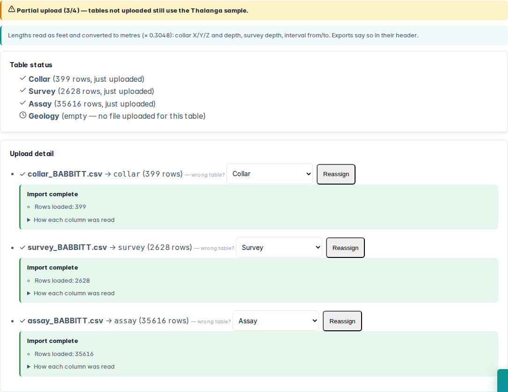

Hasilnya sebaran 5.488 × 3.449 m, yang masuk akal untuk satu endapan.

> Opsi konversi ini ditambahkan ke GeoSuite justru karena vignette ini. Sebelumnya tidak ada cara mengimpor data feet dengan benar.

---

## 2. Validasi, dan satu bug yang ditemukan data ini

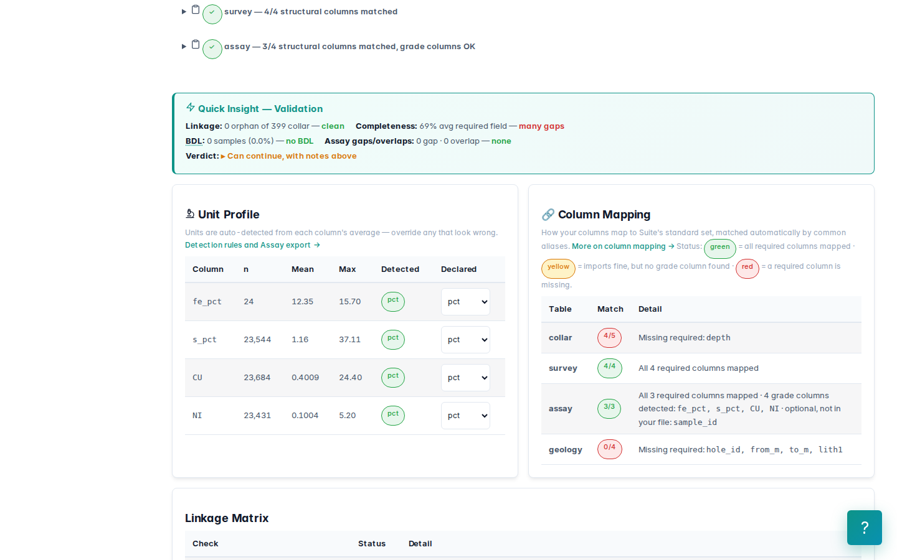

Keterkaitan tabel bersih: tidak ada lubang yatim, tidak ada collar ganda, tidak ada gap atau overlap. Dua catatan:

- **Collar tanpa kedalaman akhir (EOH).** Pemeriksaan kelengkapan collar gagal (80 %) karena kolom `depth` tidak ada. Core sekarang memanjangkan jejak lubang sampai interval terdalam yang tercatat.
- **Dua lubang hanya punya satu stasiun survey** (di kedalaman 0).

Kombinasi keduanya membuka sebuah **bug nyata** di GeoSuite. Jejak lubang dulu hanya dipanjangkan sampai `collar.depth`. Tanpa kolom itu, setiap sampel di bawah stasiun survey terakhir ditumpuk *di titik stasiun itu*. Pada lubang satu-stasiun, seluruh sampelnya menumpuk di collar: di Babbitt ada 97 sampel. Contoh B1-001 (−60° ke 327°): titik tengah interval terdalamnya (kedalaman ±129 m di sepanjang lubang) seharusnya berada di elevasi **382,53 m**, bukan di elevasi collar 494,05 m. Nilai 382,53 dihitung ulang dengan trigonometri di runner dan dicocokkan dengan ekspor Core.

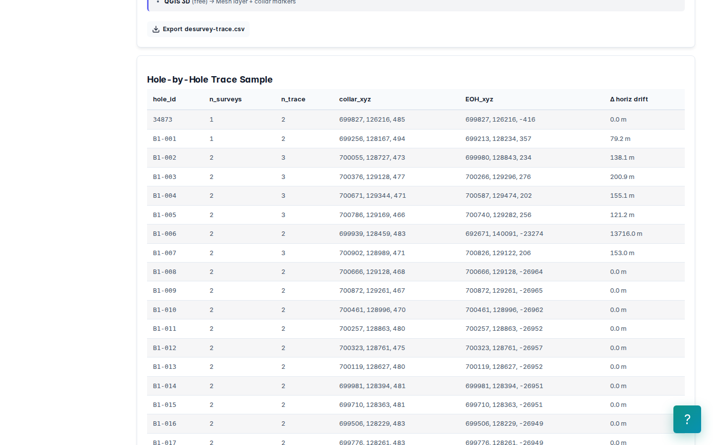

Bug ini sudah diperbaiki, dan kini dijaga oleh `test_lab_conventions.py`. **Pelajaran untuk geologis:** "tidak ada error" tidak sama dengan "posisi sampel benar". Periksa satu-dua lubang secara manual. Itu murah, dan bisa menyelamatkan seluruh model.

---

## 3. 61 % core tidak pernah dianalisis: tidak diketahui ≠ nol

| | Panjang |
|---|---:|
| Total dibor | 164.967 m |
| Dianalisis (ada Cu) | 63.726 m |
| **Tidak dianalisis** | **101.241 m (61,4 %)** |

Contohnya lubang 34873: 0–766,6 m tanpa analisis, sebuah interval batuan penutup di atas zona basal. Rata-rata Cu tertimbang panjang:

| Perlakuan interval tak dianalisis | Rata-rata Cu |
|---|---:|
| Tidak diketahui (dikeluarkan dari rata-rata) | **0,3638 %** |
| Nol ("pasti barren") | **0,1405 %** |

Selisihnya **2,6 kali**, dan tutorial perangkat lunak geostatistik terkenal pun memakai perlakuan "nol". Mana yang benar? **Tergantung geologinya, dan itu keputusan geologis, bukan program:**

- interval penutup (batuan di atas intrusi, sedimen) yang memang tidak dianalisis karena jelas barren → nol bisa dibenarkan, *di luar* domain mineralisasi;
- interval *di dalam* zona yang terlewat karena anggaran analisis → nol adalah bias rendah yang serius.

GeoSuite memperlakukan interval tak dianalisis sebagai **tidak diketahui**: kadar komposit kosong, tidak nol. Sejak vignette ini, **coverage komposit hanya menghitung panjang yang benar-benar dianalisis**. Sebelumnya komposit di dalam core tak dianalisis dilaporkan coverage 1,0 dengan kadar kosong. Sekarang **33.236 komposit** jujur dilaporkan di bawah 50 % terisi.

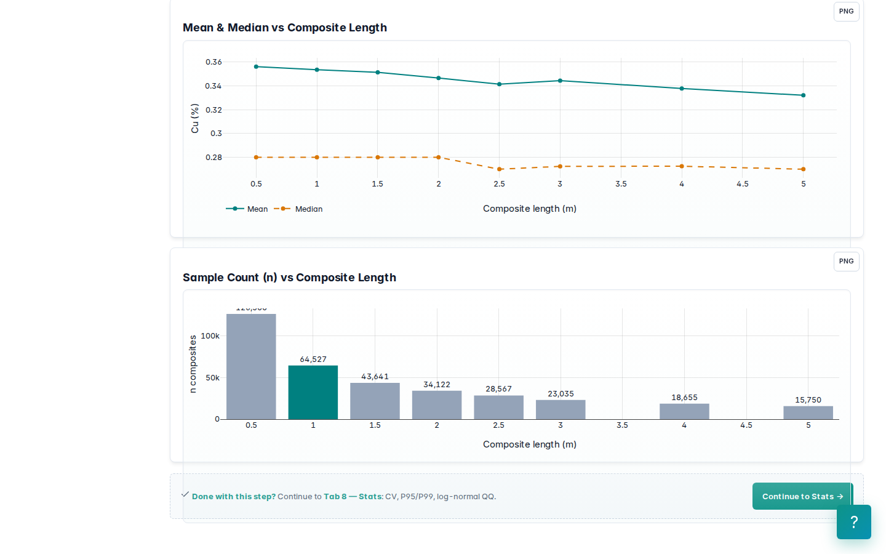

---

## 4. Assay: populasi, top-cut yang memang tepat, domain

Master CSV dari Core diunggah ke Assay. Kolom `CU`, `NI`, `S`, `FE` tanpa satuan dikenali sebagai persen (`cu_pct` …). Nilainya (median Cu 0,30) cocok dengan persen, bukan ppm. Periksa sendiri: Cu 0,30 ppm tidak masuk akal pada zona sulfida.

Korelasi Cu–Ni **r = 0,711**, rasio Ni/Cu median **0,241**. Itu pola khas sulfida magmatik Duluth: Cu sekitar empat kali Ni dan keduanya bergerak bersama.

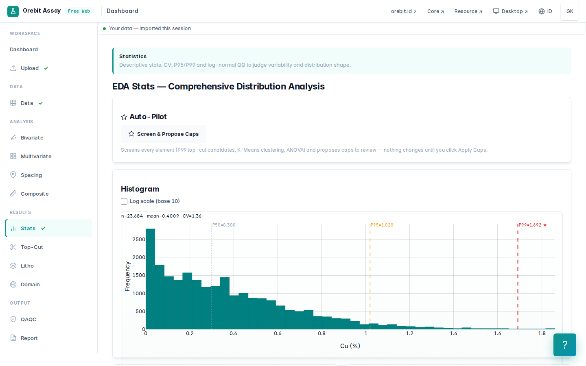

### Distribusinya

| Cu (%) | |
|---|---:|
| Median / P99 / P99,9 | 0,30 / 1,70 / 6,5 |
| Maksimum | 24,4 |

Di atas sekitar 5 % ada puluhan sampel **sulfida semi-masif**: Cu 5–24 % dengan S hingga 18 %. Sampel-sampel itu nyata, tetapi merupakan populasi yang tipis dan tidak kontinu, dikelilingi mineralisasi tersebar 0,3–1 %.

### Diagnostik top-cut: aplikasi menolak mengusulkan angka

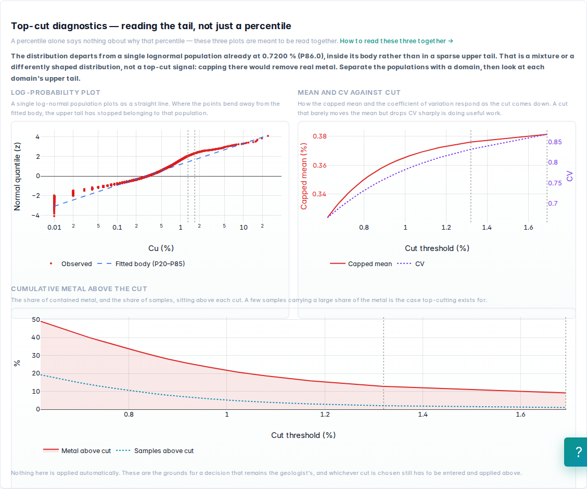

Distribusi Cu sudah menyimpang dari satu populasi lognormal sejak **0,72 % (P86)**, di dalam badan distribusi, bukan di ekor atas yang jarang. Versi GeoSuite sebelumnya menawarkan titik itu sebagai "kandidat disintegrasi". Memangkas di 0,72 % akan membuang 15 % logam. Sekarang aplikasi menyebutnya apa adanya: **campuran populasi, obatnya domain, bukan top-cut**.

### Keputusan: domain dulu, lalu top-cut 3 % Cu

1. **Domain:** *grade shell* 0,2 % Cu. Ia memuat 91,4 % logam pada 62,5 % panjang yang dianalisis. Batas 0,2 % dekat dengan batas bawah mineralisasi tersebar di Duluth dan memisahkan batuan intrusif yang nyaris barren.

   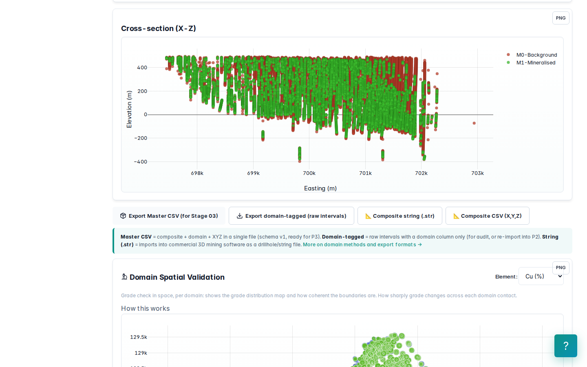

2. **Top-cut 3 % Cu**, diterapkan pada assay mentah sebelum kompositing:

| | |
|---|---:|
| Assay yang terpotong | 94 |
| Logam yang terbuang, tertimbang panjang (hitung independen) | 1,68 % |
| Logam yang terbuang menurut aplikasi (per sampel, tanpa bobot panjang) | 2,99 % |
| CV di dalam shell 0,2 %: sebelum → sesudah | 1,07 → 0,66 |
| P99,5 di dalam shell | 3,5 |

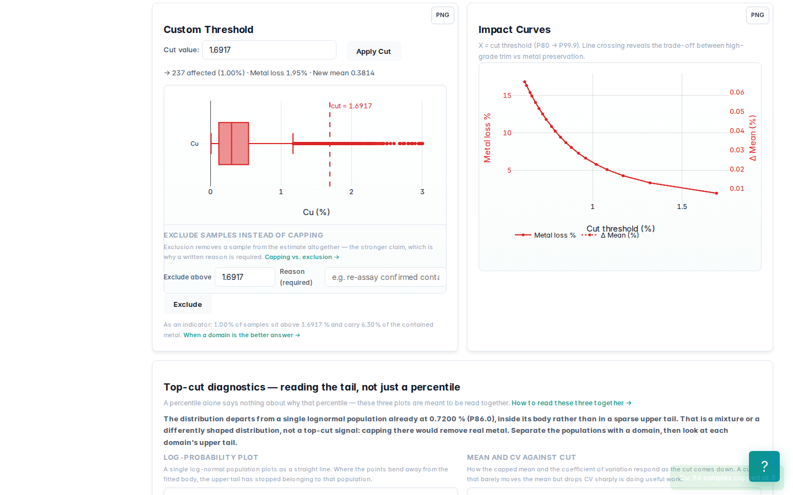

Mengapa di sini top-cut **tepat**, padahal di Thalanga (vignette 01) **tidak**:

| | Thalanga | Babbitt |
|---|---|---|
| Kadar tinggi berasal dari | populasi bijih utama (sulfida masif) | segregasi semi-masif yang tipis dan jarang |
| Kontinuitas antar lubang | lensa yang ditambang | tidak: satu-dua sampel per lubang |
| Jarak pencarian vs. ukuran populasi | radius kecil, populasi besar | radius 200 m, populasi berukuran meter |
| CV di dalam domain | 1,15 | 1,07, turun ke 0,66 dengan 94 sampel |

Satu assay 24 % Cu dengan radius pencarian 200 m menyebarkan kadar sulfida masif ke puluhan blok yang sebenarnya mineralisasi tersebar. Itulah alasan top-cut dipakai. Pilihan alternatif yang lebih baik secara geologi adalah **domain berkadar tinggi tersendiri**, tetapi tanpa logging litologi itu tidak bisa dibangun.

Header ekspor mencatat keputusan ini:

```
# topcut: cu_pct cut=3.0000 affected=94/23684 metal_removed=2.99% applied_by=manual
```

> Catatan jujur: angka *metal_removed* dari aplikasi menjumlahkan nilai assay tanpa bobot panjang. Untuk sampel yang panjangnya berbeda-beda, angka tertimbang panjang (1,68 %) yang benar. Keterbatasan ini dicatat untuk diperbaiki.

### Kompositing 10 ft (3,048 m)

| | |
|---|---:|
| Komposit | 55.119 (M1: 13.464, M0: 41.655) |
| Komposit di M1: rata-rata / CV / maks. | 0,5235 % / 0,59 / 3,0 % |
| Sebaran M1 (X × Y × Z) | 4.824 × 3.453 × 869 m |

Bug kedua yang ditemukan di tahap ini: **koordinat komposit**. Setiap komposit dulu diberi titik tengah interval mentah yang memuatnya. Semua komposit yang dipotong dari satu interval panjang, misalnya 252 komposit dari interval 766 m di lubang 34873, jatuh di **satu titik yang sama**. Pasangan berjarak nol dengan kadar berbeda menaikkan nugget, dan titik ganda membuat sistem kriging singular. Sekarang posisi diinterpolasi sepanjang lubang pada kedalaman tengah komposit itu sendiri (`test_estimation_inputs.py`).

---

## 5. Variogram dan model blok

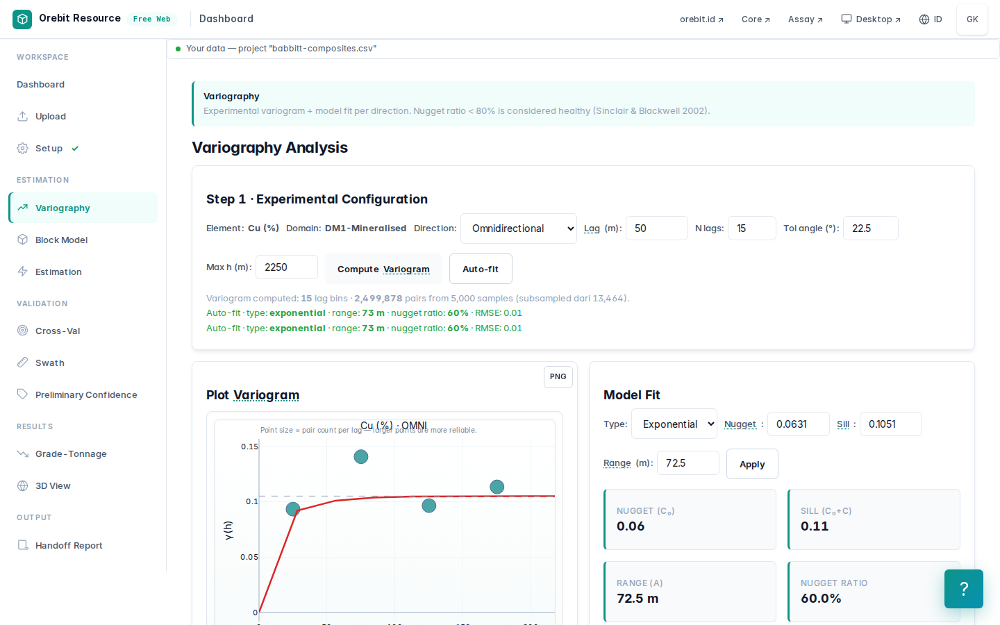

Model otomatis: eksponensial, nugget **0,063**, sill **0,105** (%²), yaitu nugget **60 %**. Range **72,5 m**.

Jarak antar lubang terdekat: **median 107 m, P90 150 m**. **Range variogram lebih pendek dari jarak antar lubang.** Artinya struktur spasial yang terukur hampir seluruhnya berasal dari pasangan *sepanjang lubang*. Pada jarak antar lubang, kriging hampir tidak punya informasi korelasi dan akan menghasilkan sesuatu yang dekat dengan rata-rata lokal. Pada endapan berlapis seperti ini, variogram yang lebih jujur adalah **variogram berarah sejajar pelapisan**. Kita catat sebagai keterbatasan.

Ukuran blok: aplikasi menyarankan 55 × 55 × 28 m. Dipakai **50 × 50 × 15 m** (sekitar ½ jarak lubang; 15 m ≈ 50 ft, tinggi bench tambang terbuka), sehingga **237.475 blok**.

---

## 6. Estimasi

Radius pencarian 200 × 200 × 30 m (horizontal, sekitar dua kali jarak lubang; vertikal sempit karena mineralisasi berlapis), minimal 4 / maksimal 16 komposit.

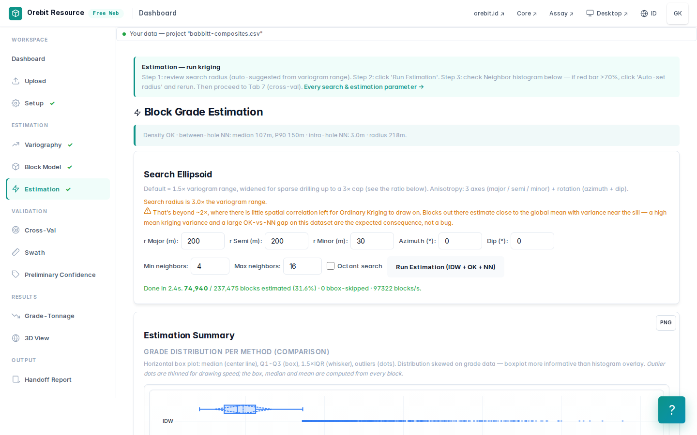

| | OK | IDW | NN |
|---|---:|---:|---:|
| Blok terestimasi | 74.940 | | |
| Kadar rata-rata Cu | **0,479 %** | 0,483 % | 0,460 % |
| Tonase (2,8 t/m³) | **7.869 Mt** | | |
| Logam Cu | 37,7 Mt | | |

Cek rata-rata global: OK lebih tinggi **4 %** dari NN, masih dalam batas ±5 % yang lazim. Cek ulang tonase: 74.940 blok × 37.500 m³ × 2,8 t/m³ = 7.869 Mt. Cocok.

---

## 7. Validasi silang: di sini bug ketiga ditemukan

Validasi silang *leave-one-out* versi sebelumnya mencari tetangga **hanya di antara 200 sampel acak** yang sedang diuji, bukan di antara 13.464 komposit. Pada data rapat, setiap sampel uji hanya "melihat" beberapa titik acak yang jaraknya kilometer, sehingga **hanya 10 dari 200** yang bisa dihitung. Sampel acaknya juga tidak ber-*seed*, jadi angkanya berubah setiap kali dijalankan. Kini tetangga diambil dari semua sampel dan subsampel memakai seed tetap.

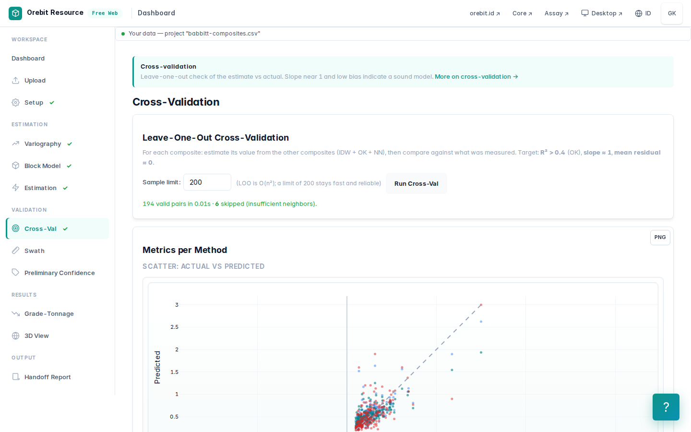

| n = 194 dari 200 | OK | IDW | NN |
|---|---:|---:|---:|
| Slope (estimasi terhadap aktual) | **0,50** | 0,68 | 0,68 |
| r² | 0,61 | 0,62 | 0,47 |
| Bias rata-rata | +0,02 | +0,03 | +0,02 |

Tidak bias secara global, tetapi **slope 0,50 berarti perataan berat**: kadar tinggi sangat diremehkan dan kadar rendah dilebih-lebihkan. Ini konsisten dengan nugget 60 % dan range yang lebih pendek dari jarak lubang (§5). Akibatnya pada kurva grade-tonnage, **tonase di cut-off rendah terlalu besar dan kadar di cut-off tinggi terlalu rendah**. Kurva ini tidak boleh dipakai untuk memilih cut-off penambangan tanpa koreksi *change of support*.

---

## 8. Grade-tonnage dan uji kewajaran

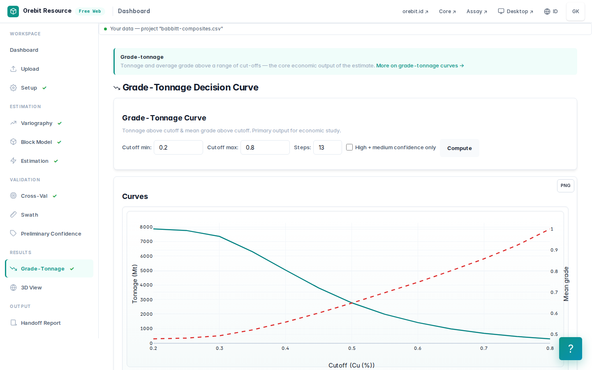

| Cut-off Cu | Tonase (Mt) | Kadar Cu |
|---|---:|---:|
| 0,2 % | 7.869 | 0,479 % |
| 0,3 % | 7.354 | 0,494 % |
| 0,4 % | 5.036 | 0,559 % |
| 0,5 % | 2.785 | 0,649 % |
| 0,6 % | 1.425 | 0,748 % |
| 0,8 % | 306 | 1,00 % |

Dibanding deskripsi publik (**> 1 miliar ton @ ~0,43 % Cu**): kadarnya sebanding, tetapi **tonase kita sekitar 8 kali lebih besar**. Penyebabnya bukan satuan, karena kita sudah mengonversi feet. Penyebabnya adalah prinsip pelaporan yang paling sering dilupakan:

**Sumber Daya Mineral harus punya *reasonable prospects for eventual economic extraction* (RPEEE).** Estimasi kita adalah **inventaris geologi**: semua blok dalam *shell* 0,2 % Cu, sampai kedalaman 869 m di bawah permukaan, dalam jangkauan 200 m dari lubang mana pun. Sumber daya yang dilaporkan dibatasi oleh:

- **cut-off ekonomi** (untuk Cu-Ni-PGE biasanya berbasis NSR, bukan Cu saja);
- **cangkang tambang terbuka yang dioptimasi** (*pit shell*), sehingga blok dalam di bawah dasar pit tidak dihitung;
- klasifikasi keyakinan yang wajar, sehingga blok jauh dari data (yang dijangkau radius 200 m) tidak masuk.

Ditambah densitas: 2,8 t/m³ adalah asumsi. Troktolit/gabro Duluth umumnya sekitar 2,9–3,0 t/m³, dan densitas terukur justru *menambah* tonase.

---

## 9. Ini bukan Sumber Daya Mineral. Yang dibutuhkan:

- [ ] Logging litologi dan **model geologi** zona basal / batuan penutup / sulfida semi-masif;
- [ ] **Variogram berarah** sejajar pelapisan, dan elipsoid pencarian yang mengikuti kemiringannya;
- [ ] **Domain kadar tinggi** untuk sulfida semi-masif sebagai pengganti top-cut;
- [ ] Keputusan geologis atas **interval tak dianalisis** di dalam zona;
- [ ] **Densitas terukur**; **QAQC** kampanye bor historis dan modern;
- [ ] **NSR** Cu-Ni-Co-PGE, **pit shell**, dan cut-off ekonomi (RPEEE);
- [ ] Koreksi **change of support** sebelum membaca kurva grade-tonnage;
- [ ] Klasifikasi dan laporan oleh **Competent Person** (KCMI 2017 / JORC 2012 / NI 43-101 / S-K 1300).

## Coba sendiri

1. Impor ulang **tanpa** mengaktifkan Feet, lalu bandingkan tonase dengan §6. Rasionya seharusnya sekitar 35.
2. Jalankan tanpa top-cut. Berapa banyak blok berkadar > 1 % yang muncul, dan di mana letaknya?
3. Naikkan cut-off domain ke 0,3 %. Bagaimana nugget dan slope validasi silang berubah?
4. Batasi radius horizontal ke 110 m (sekitar jarak lubang). Berapa tonase yang hilang, dan blok mana saja?

## Atribusi

Data bor Babbitt: Natural Resources Research Institute, University of Minnesota Duluth — basis data bor Duluth Complex (NRRI/TR-2003/21), didistribusikan bersama [pygslib](https://github.com/opengeostat/pygslib) (© Adrian Martinez Vargas, lisensi MIT) di `doc/source/Tutorial_1/Babbitt`. Deskripsi sumber daya Mesaba: publikasi Teck (CESL, ALTA 2009) tentang pemulihan nikel dari konsentrat Mesaba. Untuk angka resmi terkini, lihat laporan teknis NI 43-101 Mesaba yang diterbitkan PolyMet Mining (2022).
