# Vignette 02 — Babbitt (Cu-Ni, Duluth Complex): feet, core yang tidak dianalisis, dan estimasi pada data rapat

Contoh pembanding yang dapat direproduksi ini memakai **envelope screening XY** secara eksplisit di Block Model → Advanced. Proyek baru memakai kedekatan sampel 3D; pilih XY untuk mengulang angka di bawah. Kedua envelope bukan solid geologi tertutup.

> **English:** [en/02-babbitt-cuni.md](en/02-babbitt-cuni.md) · Vignette sebelumnya: [01 — Thalanga](01-thalanga-vms.md)

| | |
|---|---|
| **Data** | Basis data bor Babbitt (Cu-Ni-PGE), Duluth Complex, Minnesota — dari basis data Duluth Complex milik Natural Resources Research Institute, University of Minnesota (NRRI/TR-2003/21), sebagaimana didistribusikan bersama Tutorial 1 [pygslib](https://github.com/opengeostat/pygslib) (MIT). Data tidak disalin ke repositori ini; runner membaca salinan lokal atau mengunduhnya dari commit pygslib yang dipatok. |
| **Modul** | Core → Assay → Resource |
| **Pelajaran** | Satuan feet · 61 % core tidak dianalisis · kapan top-cut *memang* tepat · estimasi pada data rapat · mengapa "estimasi" belum "sumber daya" |
| **Bisa diulang** | `python3 docs/vignettes/tools/run_babbitt.py` (±130 detik). Semua angka dibaca dari [`data/babbitt.json`](data/babbitt.json) dan diperiksa ulang oleh `test_vignettes.py`. |

Vignette 01 (Thalanga) adalah kasus data yang *terlalu sedikit*: 13 lubang tanpa litologi. Babbitt kebalikannya: **399 lubang, 35.616 interval assay, lebih dari 160 km core**. Data sebanyak ini menjebak dengan cara lain. Tidak ada yang tampak salah, programnya berjalan mulus, dan angkanya bisa meleset satu orde besaran.

Endapan Babbitt (sekarang dikenal sebagai Mesaba) adalah mineralisasi Cu-Ni-PGE tersebar di bagian basal Duluth Complex, sebuah intrusi berlapis. Mineralisasinya kontinu, berkadar rendah, dan secara umum sejajar kontak basal yang landai. Deskripsi publik Teck menyebut sumber daya geologinya **lebih dari 1 miliar ton pada sekitar 0,43 % Cu dan 0,09 % Ni**. Angka itu patokan kewajaran kita di §8.

---

> **Pembaruan perhitungan, 7 Oktober 2026:** rekaman ini memakai range fisik hasil fit untuk covariance scalar. Radius pencarian memilih neighbour; tidak lagi menggantikan range model. Tabel dan screenshot UI direkam ulang dari upload CSV; grade-tonnage ekspor dihitung ulang independen. Session historis perlu di-refit untuk memakai mode yang dikoreksi.

## 1. File yang tidak mengatakan satuannya

```
collar_BABBITT.csv   BHID, XCOLLAR, YCOLLAR, ZCOLLAR           ← tanpa kolom kedalaman
survey_BABBITT.csv   BHID, AT, AZ, DIP
assay_BABBITT.csv    BHID, FROM, TO, CU, NI, S, FE             ← tanpa satuan di header
```

Tidak ada satu pun keterangan bahwa semua panjang dalam file ini dalam **feet**. Petunjuknya harus dicari sendiri:

- panjang sampel yang dominan tepat **10,0** (78 % interval), angka bulat khas feet (10 ft = 3,048 m);
- elevasi collar sekitar 1.590, padahal permukaan di Minnesota timur laut sekitar 480 m dpl. Angka itu masuk akal hanya dalam feet;
- sebaran collar 18.006 × 11.316. Sebagai meter itu 18 × 11 km, terlalu luas untuk satu endapan.

Kalau dibaca sebagai meter, setiap panjang 3,28 kali terlalu besar, sehingga **setiap volume 3,28³ = 35,3 kali terlalu besar**, begitu pula tonase dan logamnya. Tidak ada error dan tidak ada peringatan, karena file feet tidak "rusak".

**Di Core:** *Upload* → *Import Options* → **Length unit in the files: Feet (convert to metres)**, lalu unggah ketiga file. Core mengalikan X/Y/Z collar, kedalaman survey, dan from/to dengan 0,3048, lalu menuliskannya di laporan impor dan di header setiap ekspor:

```
# lengths: metres (converted from feet x0.3048 on import: collar x/y/z/depth, survey depth, from/to)
```

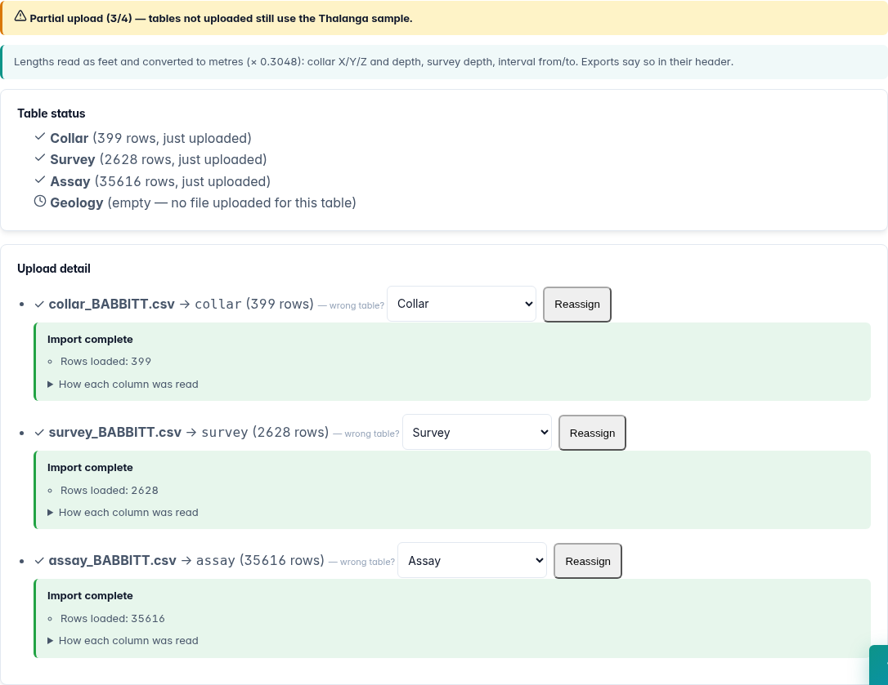

Hasilnya sebaran 5.488 × 3.449 m, yang masuk akal untuk satu endapan.

> Opsi konversi ini ditambahkan ke GeoSuite justru karena vignette ini. Sebelumnya tidak ada cara mengimpor data feet dengan benar.

---

## 2. Validasi, dan satu bug yang ditemukan data ini

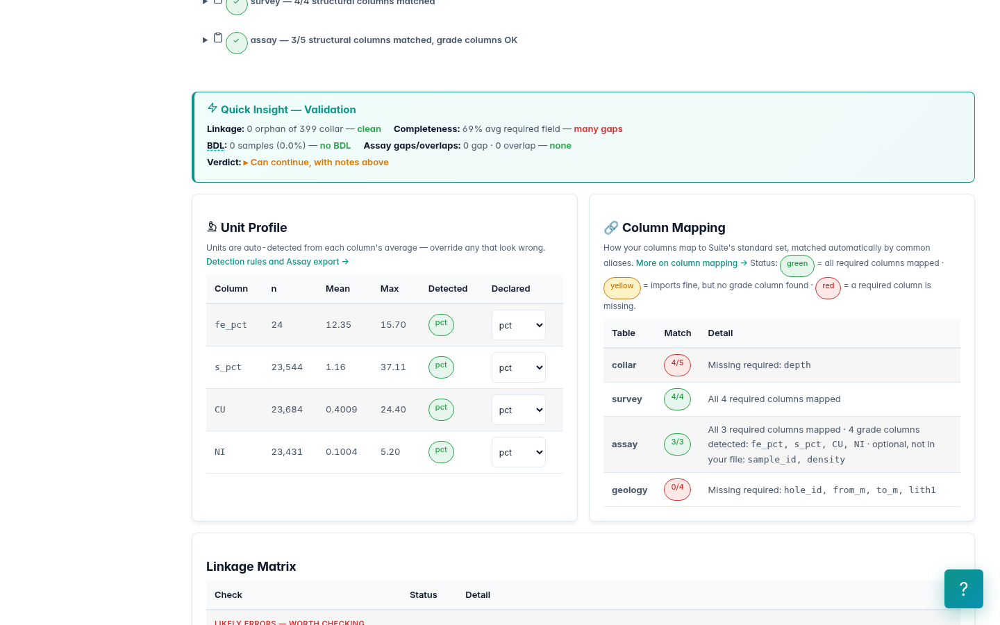

Keterkaitan tabel bersih: tidak ada lubang yatim, tidak ada collar ganda, tidak ada gap atau overlap. Dua catatan:

- **Collar tanpa kedalaman akhir (EOH).** 399 kedalaman akhir yang hilang dilaporkan sebagai peringatan; kelengkapan bidang geometri wajib tetap 100 %. Core memakai arah stasiun survey terakhir untuk mencapai interval terdalam yang tercatat, tanpa mengisi atau mengubah `collar.depth`. Ekstrapolasi ini merupakan asumsi arah, bukan pengukuran kedalaman akhir.
- **Dua lubang hanya punya satu stasiun survey** (di kedalaman 0).

Kombinasi keduanya membuka sebuah **bug nyata** di GeoSuite. Jejak lubang dulu hanya dipanjangkan sampai `collar.depth`. Tanpa kolom itu, setiap sampel di bawah stasiun survey terakhir ditumpuk *di titik stasiun itu*. Pada lubang satu-stasiun, seluruh sampelnya menumpuk di collar: di Babbitt ada 97 sampel. Contoh B1-001 (−60° ke 327°): titik tengah interval terdalamnya (kedalaman ±129 m di sepanjang lubang) seharusnya berada di elevasi **382,53 m**, bukan di elevasi collar 494,05 m. Nilai 382,53 dihitung ulang dengan trigonometri di runner dan dicocokkan dengan ekspor Core.

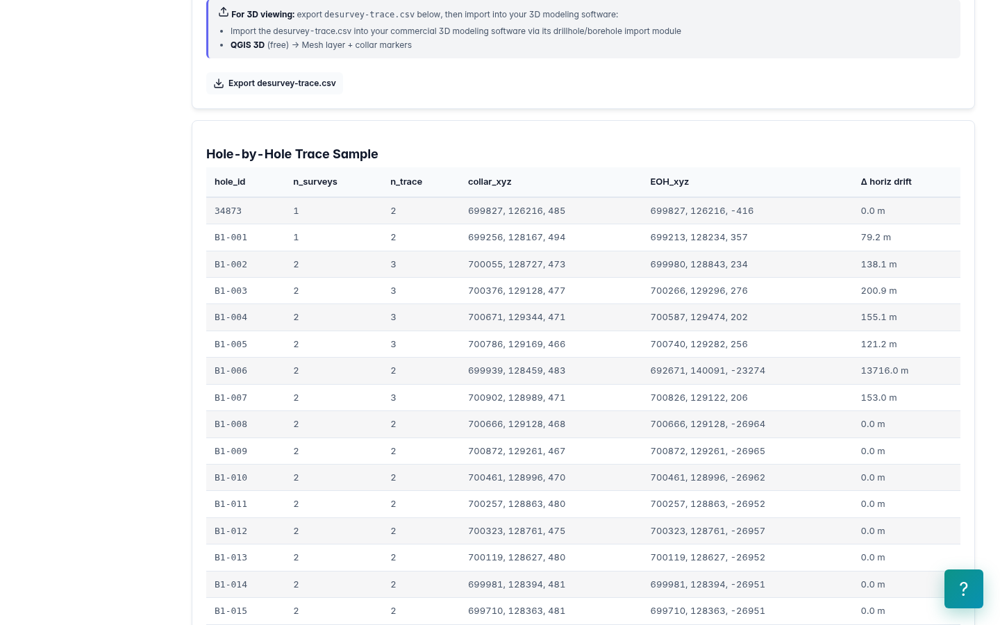

Bug ini sudah diperbaiki, dan kini dijaga oleh `test_lab_conventions.py`. **Pelajaran untuk geologis:** "tidak ada error" tidak sama dengan "posisi sampel benar". Periksa satu-dua lubang secara manual. Itu murah, dan bisa menyelamatkan seluruh model.

---

## 3. 61 % core tidak pernah dianalisis: tidak diketahui ≠ nol

| | Panjang |
|---|---:|
| Total dibor | 164.967 m |
| Dianalisis (ada Cu) | 63.726 m |
| **Tidak dianalisis** | **101.241 m (61,4 %)** |

Contohnya lubang 34873: 0–766,6 m tanpa analisis, sebuah interval batuan penutup di atas zona basal. Rata-rata Cu tertimbang panjang:

| Perlakuan interval tak dianalisis | Rata-rata Cu |
|---|---:|
| Tidak diketahui (dikeluarkan dari rata-rata) | **0,3638 %** |
| Nol ("pasti barren") | **0,1405 %** |

Selisihnya **2,6 kali**, dan tutorial perangkat lunak geostatistik terkenal pun memakai perlakuan "nol". Mana yang benar? **Tergantung geologinya, dan itu keputusan geologis, bukan program:**

- interval penutup (batuan di atas intrusi, sedimen) yang memang tidak dianalisis karena jelas barren → nol bisa dibenarkan, *di luar* domain mineralisasi;
- interval *di dalam* zona yang terlewat karena anggaran analisis → nol adalah bias rendah yang serius.

GeoSuite memperlakukan interval tak dianalisis sebagai **tidak diketahui**: kadar komposit kosong, tidak nol. Sejak vignette ini, **coverage komposit hanya menghitung panjang yang benar-benar dianalisis**. Sebelumnya komposit di dalam core tak dianalisis dilaporkan coverage 1,0 dengan kadar kosong. Sekarang **33.236 komposit** jujur dilaporkan di bawah 50 % terisi.

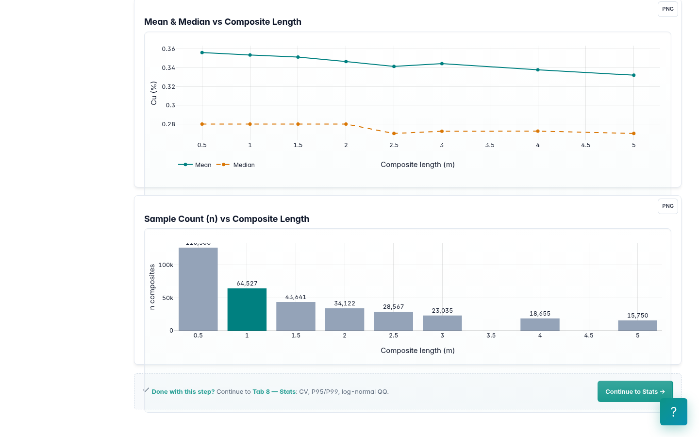

---

## 4. Assay: populasi, top-cut yang memang tepat, domain

Master CSV dari Core diunggah ke Assay. Kolom `CU`, `NI`, `S`, `FE` tanpa satuan dikenali sebagai persen (`cu_pct` …). Nilainya (median Cu 0,30) cocok dengan persen, bukan ppm. Periksa sendiri: Cu 0,30 ppm tidak masuk akal pada zona sulfida.

Korelasi Cu–Ni **r = 0,711**, rasio Ni/Cu median **0,241**. Itu pola khas sulfida magmatik Duluth: Cu sekitar empat kali Ni dan keduanya bergerak bersama.

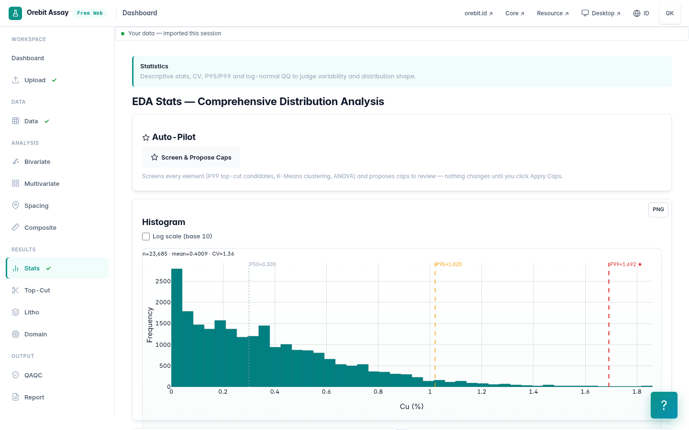

### Distribusinya

| Cu (%) | |
|---|---:|
| Median / P99 / P99,9 | 0,30 / 1,70 / 6,5 |
| Maksimum | 24,4 |

Di atas sekitar 5 % ada puluhan sampel **sulfida semi-masif**: Cu 5–24 % dengan S hingga 18 %. Sampel-sampel itu nyata, tetapi merupakan populasi yang tipis dan tidak kontinu, dikelilingi mineralisasi tersebar 0,3–1 %.

### Diagnostik top-cut: aplikasi menolak mengusulkan angka

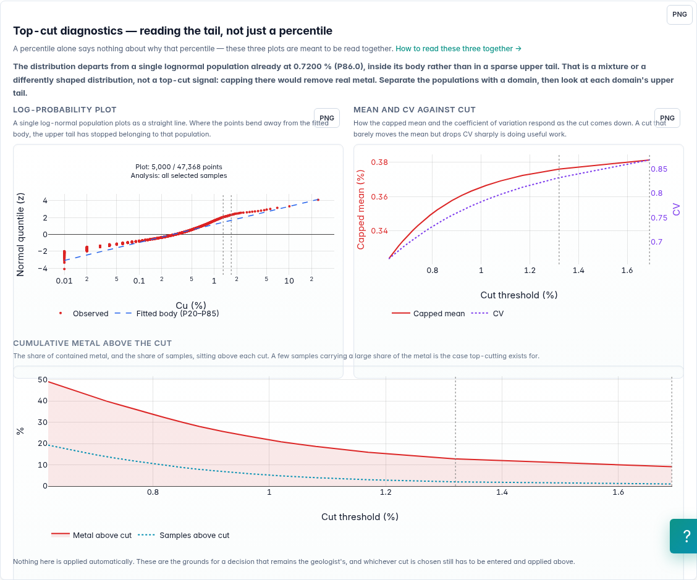

Distribusi Cu sudah menyimpang dari satu populasi lognormal sejak **0,72 % (P86)**, di dalam badan distribusi, bukan di ekor atas yang jarang. Versi GeoSuite sebelumnya menawarkan titik itu sebagai "kandidat disintegrasi". Memangkas di 0,72 % akan membuang 15 % logam. Sekarang aplikasi menyebutnya apa adanya: **campuran populasi, obatnya domain, bukan top-cut**.

### Keputusan: domain dulu, lalu top-cut 3 % Cu

1. **Domain:** *grade shell* 0,2 % Cu. Ia memuat 91,4 % logam pada 62,5 % panjang yang dianalisis. Batas 0,2 % dekat dengan batas bawah mineralisasi tersebar di Duluth dan memisahkan batuan intrusif yang nyaris barren.

   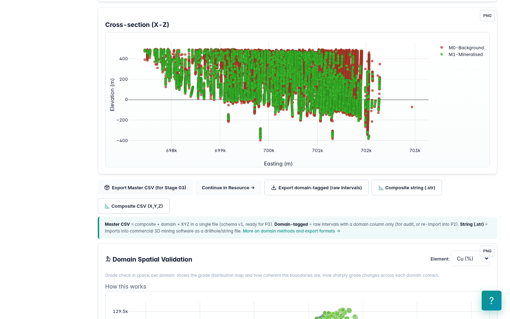

2. **Top-cut 3 % Cu**, diterapkan pada assay mentah sebelum kompositing:

| | |
|---|---:|
| Assay yang terpotong | 94 |
| Logam yang terbuang, tertimbang panjang (aplikasi = hitung independen) | 1,68 % |
| CV di dalam shell 0,2 %: sebelum → sesudah | 1,07 → 0,66 |
| P99,5 di dalam shell | 3,5 |

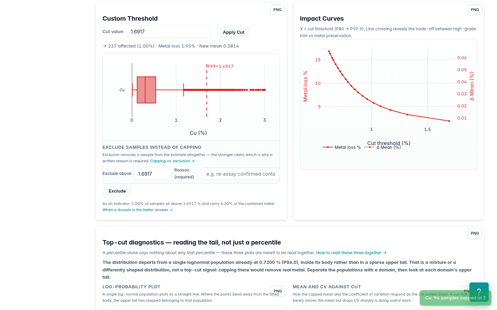

Mengapa di sini top-cut **tepat**, padahal di Thalanga (vignette 01) **tidak**:

| | Thalanga | Babbitt |
|---|---|---|
| Kadar tinggi berasal dari | populasi bijih utama (sulfida masif) | segregasi semi-masif yang tipis dan jarang |
| Kontinuitas antar lubang | lensa yang ditambang | tidak: satu-dua sampel per lubang |
| Jarak pencarian vs. ukuran populasi | radius kecil, populasi besar | radius 200 m, populasi berukuran meter |
| CV di dalam domain | 1,15 | 1,07, turun ke 0,66 dengan 94 sampel |

Satu assay 24 % Cu dengan radius pencarian 200 m menyebarkan kadar sulfida masif ke puluhan blok yang sebenarnya mineralisasi tersebar. Itulah alasan top-cut dipakai. Pilihan alternatif yang lebih baik secara geologi adalah **domain berkadar tinggi tersendiri**, tetapi tanpa logging litologi itu tidak bisa dibangun.

Header ekspor mencatat keputusan ini:

```
# topcut: cu_pct cut=3.0000 affected=94/23684 metal_removed=1.68% (length-weighted) applied_by=manual
```

> Versi sebelumnya menjumlahkan nilai assay tanpa bobot panjang dan melaporkan 2,99 %. Logam = kadar × panjang, jadi sampel 0,2 m tidak boleh berbobot sama dengan interval 3 m. Kini diperbaiki dan dicocokkan dengan hitungan independen oleh `test_vignettes.py`.

### Kompositing 10 ft (3,048 m)

| | |
|---|---:|
| Komposit | 55.119 (M1: 13.464, M0: 41.655) |
| Komposit di M1: rata-rata / CV / maks. | 0,5235 % / 0,59 / 3,0 % |
| Sebaran M1 (X × Y × Z) | 4.824 × 3.453 × 869 m |

Bug kedua yang ditemukan di tahap ini: **koordinat komposit**. Setiap komposit dulu diberi titik tengah interval mentah yang memuatnya. Semua komposit yang dipotong dari satu interval panjang, misalnya 252 komposit dari interval 766 m di lubang 34873, jatuh di **satu titik yang sama**. Pasangan berjarak nol dengan kadar berbeda menaikkan nugget, dan titik ganda membuat sistem kriging singular. Sekarang posisi diinterpolasi sepanjang lubang pada kedalaman tengah komposit itu sendiri (`test_estimation_inputs.py`).

---

Komposit dengan spasi sama dapat memberi tetangga berjarak identik. NN memakai indeks sumber terendah bila jarak ternormalisasi berbeda paling banyak 1e-10; pembulatan koordinat tidak boleh menentukan kadar. IDW dan kriging tetap memakai jarak serta bobotnya sendiri.

## 5. Variogram dan grid

Hitung Downhole lalu Compute/Auto-fit. Range di batas fitting adalah peringatan, bukan kontinuitas yang telah terbukti.

| Parameter | Result |
|---|---:|
| Downhole pairs | 183.031 |
| Nugget (%²) | 0,028 |
| First between-hole lag γ (%²) | 0,093 |
| Sill (%²) | 0,115 |
| Range (m; rangeMin flag) | 72,5 |
| Median hole spacing (m) | 106 |
| Block size | 50 ×50 ×15 m |
| Generated screening cells | 237.475 |

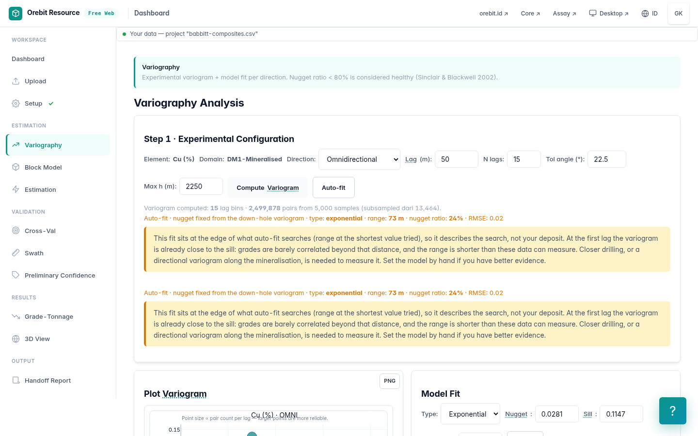

## 6. Estimasi dengan scope tercatat

| | No categorical boundary | With categorical boundary |
|---|---:|---:|
| OK cells | 74.961 | 26.825 |
| Mean Cu (%) | 0,475 | 0,500 |
| Model mass (Mt, assumed SG2.8) | 7.871 | 2.817 |
| Cu metal (Mt) | 37,4 | 14,1 |

209.515 sel dalam jangkauan ditolak oleh penugasan domain. Batas kategorikal ini bukan solid geologi. Komposit tak dianalisis perlu review sebelum dianggap batuan penutup; raw missing grade bukan kadar nol.

NN mean: 0,509 %; OK mean: 0,500 %. 26.825 × 37.500 m³ ×2.8 t/m³ = 2.817 Mt.

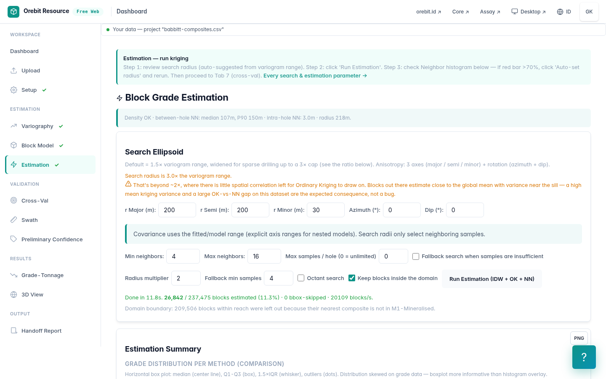

## 7. Cross-validation

Tetangga berasal dari seluruh populasi; sampel uji memakai seed tetap. Leave-one-out memperoleh 194/200 pairs.

| Method | Slope | r² | Bias | RMSE |
|---|---:|---:|---:|---:|
| OK | 0,64 | 0,64 | 0,03 | 0,202 |
| IDW | 0,68 | 0,61 | 0,03 | 0,211 |
| NN | 0,71 | 0,49 | 0,03 | 0,260 |

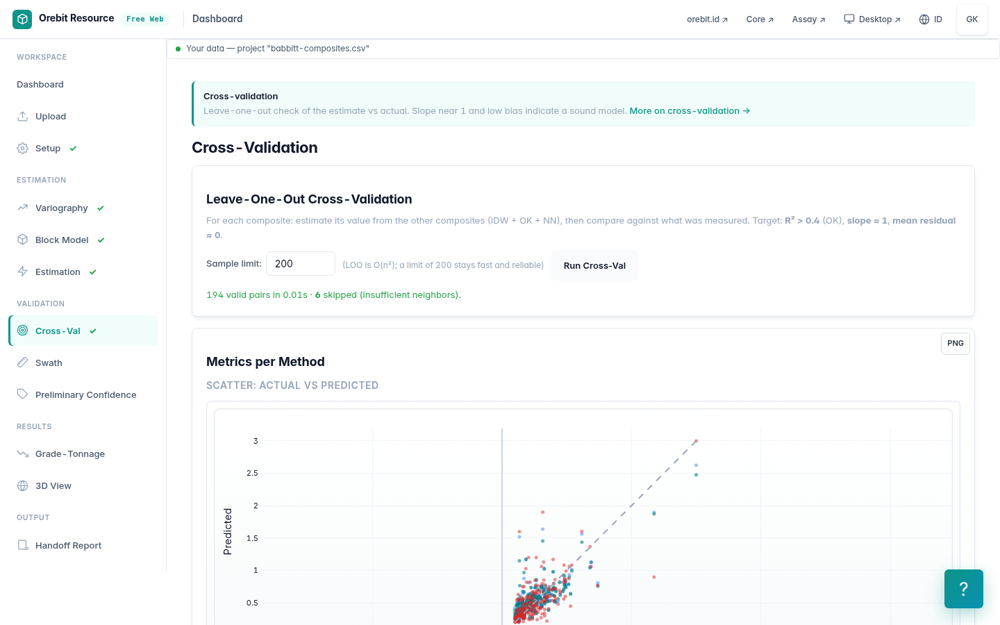

Slope di bawah1 menunjukkan smoothing; bias rata-rata kecil tidak membuktikan blok individual. Jarak bor, support dan geologi tetap membatasi resolusi.

## 8. Grade-tonnage

| Cu cutoff (%) | Model mass (Mt) | Mean Cu (%) |
|---|---:|---:|
| 0,20 | 2.817 | 0,500 |
| 0,25 | 2.796 | 0,502 |
| 0,30 | 2.678 | 0,512 |
| 0,35 | 2.374 | 0,536 |
| 0,40 | 1.990 | 0,567 |
| 0,45 | 1.577 | 0,604 |
| 0,50 | 1.189 | 0,646 |
| 0,55 | 870 | 0,690 |
| 0,60 | 623 | 0,737 |
| 0,65 | 437 | 0,785 |
| 0,70 | 307 | 0,832 |
| 0,75 | 209 | 0,883 |
| 0,80 | 130 | 0,951 |

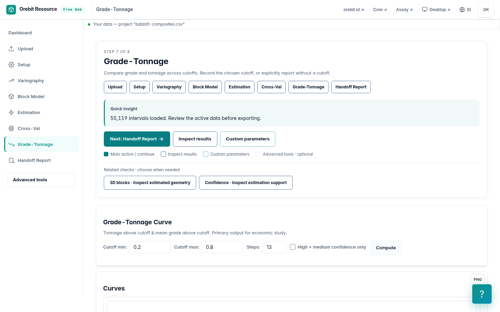

Nilai cutoff ditulis persis:0,25% berbeda dari0,20%. Mass dihitung dari volume sel ×densitas; feet sudah dikonversi ke meter. Ini masih inventaris screening dengan asumsi SG, belum resource yang dibatasi RPEEE, pit shell atau NSR.

## 9. Langkah berikutnya

Tinjau litologi/solid zona basal, missing assays, densitas terukur, QA/QC, domain kadar tinggi, variogram berarah, NSR/pit shell, change of support dan klasifikasi CP. Top-cut yang diterapkan di Assay dicatat; Resource tidak menerapkannya lagi.

Source tetap, tetapi posisi interval sekarang mengikuti minimum-curvature arcs. Perubahan posisi dapat mengubah tetangga dan blok di batas support. Koordinat komposit dari midpoint-only CSV masih berupa interpolasi; transport trace/endpoints penuh mengikuti gate Domain S8.

## Atribusi

Data bor Babbitt: Natural Resources Research Institute, University of Minnesota Duluth — basis data bor Duluth Complex (NRRI/TR-2003/21), didistribusikan bersama [pygslib](https://github.com/opengeostat/pygslib) (© Adrian Martinez Vargas, lisensi MIT) di `doc/source/Tutorial_1/Babbitt`. Deskripsi sumber daya Mesaba: publikasi Teck (CESL, ALTA 2009) tentang pemulihan nikel dari konsentrat Mesaba. Untuk angka resmi terkini, lihat laporan teknis NI 43-101 Mesaba yang diterbitkan PolyMet Mining (2022).
